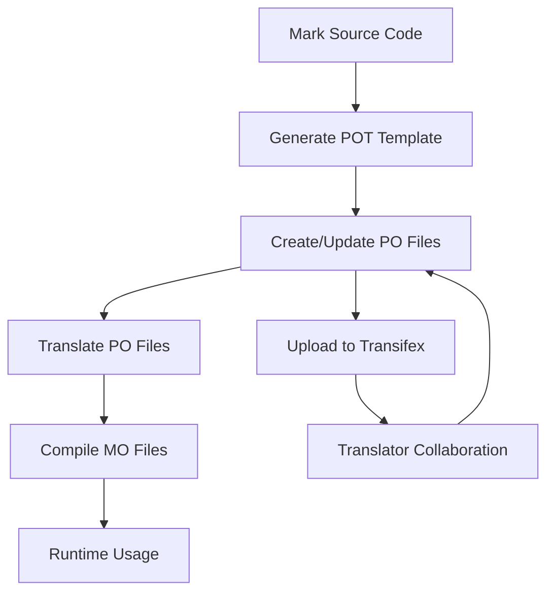

# Build Guide

## Build Dependencies

Before building Linglong, ensure the following dependencies are installed:

- cmake
- debhelper-compat (= 12)
- intltool
- libcap-dev
- libcli11-dev (>= 2.4.1) | hello
- libcurl4-openssl-dev
- libdeflate-dev
- libelf-dev
- libexpected-dev (>= 1.0.0~dfsg-2~bpo10+1) | hello
- libfuse3-dev
- libglib2.0-dev
- libgmock-dev
- libgtest-dev
- liblz4-dev
- liblzma-dev
- libostree-dev
- libpcre2-dev
- libselinux1-dev
- libssl-dev
- libsystemd-dev
- libyaml-cpp-dev (>= 0.6.2)
- libzstd-dev
- nlohmann-json3-dev (>= 3.5.0)
- pkg-config
- qt6-base-dev | qtbase5-dev
- qt6-base-private-dev | qtbase5-private-dev
- systemd
- uuid-dev
- zlib1g-dev

For running the unit tests (`ll-tests`) you also need:

- `erofs-utils` (provides `mkfs.erofs`, used by the `LayerPackagerTest` and `UabFileTest` suite setup)

Linglong uses [cmake presets]. To build and install:

```bash
cmake --workflow --preset release
sudo cmake --install build-release
```

For development/debugging:

```bash
export CMAKE_CXX_COMPILER_LAUNCHER="$(command -v ccache)"

# Configure, build and test
cmake --workflow --preset debug

# Configure only
cmake --preset debug

# Build only
cmake --build --preset debug

# Test only
ctest --preset debug
```

[cmake presets]: https://cmake.org/cmake/help/latest/manual/cmake-presets.7.html

## Build-Time Profiling

To locate compile-time hot spots (slowest files, heaviest headers, template
instantiation costs), build with Clang `-ftime-trace` and aggregate the traces
with [clang-build-analyzer]:

```bash
tools/analyze-build.sh
```

This configures the `build-trace` preset (Clang + `ENABLE_BUILD_TRACE=ON`),
builds the project, then prints a hot-spot report. The aggregated trace is
written to `build-trace/build-analysis.json`. `clang-build-analyzer` is built
from source into `~/.cache/clang-build-analyzer` on first run if not on PATH.

You can also drive the preset manually:

```bash
cmake --preset build-trace
cmake --build --preset build-trace
```

Each translation unit emits a `*.json` trace file (Chrome tracing format) that
can be opened in `chrome://tracing` for a per-file timeline.

[clang-build-analyzer]: https://github.com/CacheFactory/clang-build-analyzer

## Packaging

Linglong uses [CPM.cmake] to download missing dependencies locally.

To disable this feature:

```bash
export CPM_USE_LOCAL_PACKAGES=1
```

See [CPM.cmake] README for more information.

[CPM.cmake]: https://github.com/cpm-cmake/CPM.cmake

## Code Style & Pre-commit

Linglong uses [clang-format] for C/C++ code style; the rules live in
[`.clang-format`](.clang-format). Before committing C/C++ changes, run clang-format
on the files you touched:

```bash
clang-format -i --sort-includes --style=file path/to/file.cpp
```

Note that `--sort-includes` reorders `#include` lines alphabetically -- if you add
includes by hand in the wrong order, the CI check will flag it. Just run clang-format
first and commit the formatted result.

The repository also uses [pre-commit] for a set of repo-wide checks (trailing
whitespace, EOF newline, YAML/JSON/XML validation, and `shfmt` for shell scripts),
which are enforced automatically on pull requests via [pre-commit.ci]. To run the
same checks locally, install and register the hooks once:

```bash
pip install pre-commit          # or: apt install pre-commit
pre-commit install              # registers the git hooks in .git/hooks/
```

After that, `git commit` runs the configured hooks. If a hook reformats a file,
the commit is blocked -- just `git add` the reformatted file and commit again. To
run them once without installing:

```bash
pre-commit run --all-files
pre-commit run clang-format --files path/to/file
```

When a [pre-commit.ci] check fails on a PR, comment `pre-commit.ci autofix` on the
PR (or apply the label) to let the bot fix and push the formatting, or fix locally
and push. The `shfmt` check (shell formatting) is only enforced by CI -- you do not
need to install it locally; just follow the existing style in shell files or let
pre-commit.ci fix them.

[clang-format]: https://clang.llvm.org/docs/ClangFormat.html
[pre-commit]: https://pre-commit.com/
[pre-commit.ci]: https://pre-commit.ci/

## Internationalization (i18n) Management

Linglong uses GNU gettext toolchain and Transifex platform for internationalization.

### Translation Workflow


```mermaid
graph TD
    A[Mark Source Code] --> B[Generate POT Template]
    B --> C[Create/Update PO Files]
    C --> D[Translate PO Files]
    D --> E[Compile MO Files]
    E --> F[Runtime Usage]
    C --> G[Upload to Transifex]
    G --> H[Translator Collaboration]
    H --> C
```

### 1. Environment Setup

#### 1.1 Install Transifex CLI

```bash
wget https://github.com/transifex/cli/releases/download/v1.6.17/tx-linux-amd64.tar.gz
tar -xzf tx-linux-amd64.tar.gz -C $HOME/.local/bin/
tx -v  # Verify version
```

#### 1.2 Configure Transifex

1. Create ~/.transifexrc:

```plaintext
[https://www.transifex.com]
rest_hostname = https://rest.api.transifex.com
api_hostname = https://api.transifex.com
hostname = https://www.transifex.com
token = <your-transifex-token>
```

2. Configure project .tx/config:

```plaintext
[main]
host = https://www.transifex.com

[o:linuxdeepin:p:linyaps:r:6e861fdc8edf8f03ac6f0b629a022f2f]
file_filter = po/<lang>.po
source_file = po/en_US.po
source_lang = en_US
type = PO
```

### 2. Translation File Management

#### 2.1 Generate POT Template

```bash
# In build directory
make pot  # Generates po/linyaps.pot
```

#### 2.2 Update PO Files

```bash
make po              # Update all PO files
make linyaps_zh_CN.po  # Update specific language
```

#### 2.3 Translation Collaboration

1. Push translation files to git repository:

```bash
git add po/linyaps.pot po/en_US.po
git push $(REMOTE) $(BRANCH)
```

2. Upload translation files to Transifex:

```bash
tx push -a # Push all languages
tx push --translation -f --languages zh_CN # Push specific language
```

**TIPS:** Typically we only push translations for the current system language, while translators will collaborate on other languages in Transifex.

3. Download translations:

```bash
tx pull -a  # All languages
tx pull -l zh_CN  # Specific language
```

### 3. Compilation & Testing

1. Compile PO to MO:

```bash
msgfmt po/zh_CN.po -o share/locale/zh_CN/LC_MESSAGES/linyaps.mo
```

2. Test translations:

```bash
LANG=zh_CN.UTF-8 ll-cli --help
```

### Best Practices

1. String Marking:

```cpp
// Use gettext macros
#include <libintl.h>
#define _(str) gettext(str)

printf(_("Hello World"));
```

2. Translation Context:

```cpp
/// TRANSLATORS: System username, max 20 chars
printf(_("User"));

// Plural forms
printf(ngettext("%d file", "%d files", count), count);
```

3. Quality Checks:

```bash
# Check untranslated strings
msgfmt --statistics po/zh_CN.po

# Validate format
msgfmt -cv po/zh_CN.po
```

4. Collaboration Standards:
   - Preserve source context
   - Avoid variable placeholders (e.g. %s)
   - Maintain terminology consistency
   - Use full-width punctuation for Chinese

5. Regular Sync:
   - Weekly POT updates to Transifex
   - Monthly full translation pulls
   - Pre-release testing:

```bash
for lang in $(cat po/LINGUAS); do
  LANG=$lang.UTF-8 ll-cli --help > /dev/null || echo "$lang test failed"
done
```

6. Common Issues:
   - Outdated translations: Use `msgmerge`
   - Format errors: Check quotes/special chars
   - Variable order: Use positional params (%1$s)
   - Length constraints: Chinese is typically shorter
