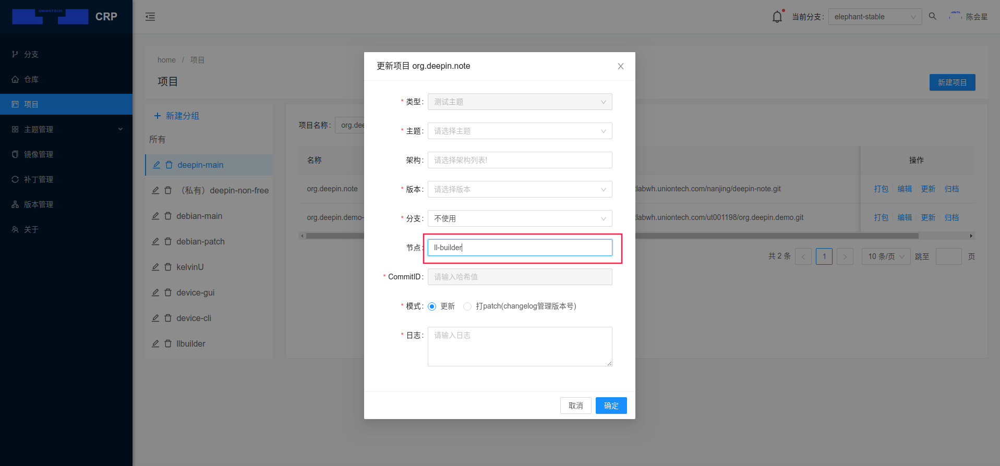

# crp平台从源码构建玲珑应用

`crp`平台已集成`ll-builder`，支持一键从源码构建出玲珑应用并推送到玲珑测试仓库。

主要步骤:

1. 源码工程目录下新增`linglong.yaml`配置文件

2. `crp`平台配置

当构建参数列表内容为`{'build': 'll-builder'}`时，shuttle使用ll-builder构建，具体参考下图：

更新项目打包时，节点需指定为`ll-builder`，才可进行玲珑构建。具体参考下图：

