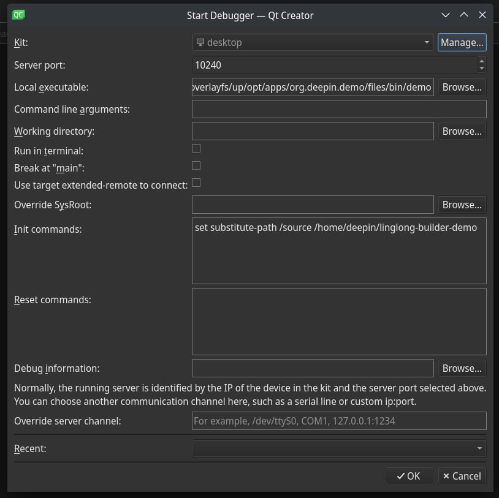

<!--
SPDX-FileCopyrightText: 2023 UnionTech Software Technology Co., Ltd.

SPDX-License-Identifier: LGPL-3.0-or-later
-->

# Debug App

The following tutorial uses the [linglong-builder-demo](https://github.com/linuxdeepin/linglong-builder-demo) project mentioned in the "Building Tools" section as an example. We put the project in `/path/to/project`. Make sure to **replace the path** when referring to this tutorial.

Since the linyaps application runs in a container, we need to use `gdbserver` to run the application in the container to debug it on the host. So you'll need to install `gdbserver` first.

We can use the `gdbserver` provided by the distribution, using `apt` as an example:

```bash
sudo apt install gdbserver gdb -y
```

Next, refer to the tutorial in "Run compiled App", run `bash` in the container through the `ll-build run` command, and run the application to be debugged through `gdbserver`:

```bash
ll-build run --exec /bin/bash

# In the container:
gdbserver:10240 deepin-draw
```

In the above command, `:10240` is any tcp port that is not currently occupied. Then we need to do two more things:

1. Use `gdb` outside the container to connect to the `gdbserver` in the container;
2. Set the source map path.

## Debugging with gdb in terminal

1. Find the location of the executable file executed in the container on the host. For the above project, the file is located in `/path/to/project/.linglong-target/overlayfs/up/opt/apps/org.deepin. demo/files/bin/demo`.

   For applications installed via `ll-cli`, the executables are generally located under `$LINGLONG_ROOT/layers/[appid]/[version]/[arch]/files/bin`.

   Use `gdb` to load the program outside the container:

   ```bash
   gdb /path/to/project/.linglong-target/overlayfs/up/opt/apps/org.deepin.demo/files/bin/demo
   ```

2. Use the `target` command in `gdb` to connect to the `gdbserver` as follows:

   ```bash
   target remote :10240
   ```

3. Enter the following command in `gdb` to set the path mapping and help `gdb` to find the corresponding source code, assuming the source code is placed in the `Desktop` of the host, the command is as follows:

   ```bash
   set substitute-path /source /path/to/project
   ```

Then just use `gdb` normally.

## QtCreator configuration

Referring to the above process, we can easily complete the configuration of `QtCreator`:

Click: Debug > Start Debugging > Connect to the Running Debug Server, and fill in the dialog box:

```text
Server port: `10240`

Local executable file: `/path/to/project/.linglong-target/overlayfs/up/opt/apps/org.deepin.demo/files/bin/demo`

Init Commands: `set substitute-path /source /path/to/project`
```

The general configuration is shown in the following figure:



After the configuration is complete, you can use `QtCreator` to debug normally.
