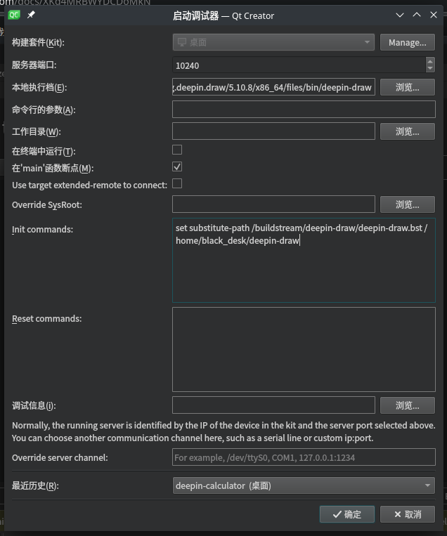

<!--
SPDX-FileCopyrightText: 2023 UnionTech Software Technology Co., Ltd.

SPDX-License-Identifier: LGPL-3.0-or-later
-->

# Debugging Linyaps Applications

This tutorial uses an example project with the application ID `org.deepin.demo`. Prepare and build the application as shown below before debugging it. For your own application, replace the application ID, executable, and project paths with the corresponding values.

## Prepare the Debugging Example

### Create the Project

Create `org.deepin.demo` under `/tmp`:

```bash
cd /tmp
ll-builder create org.deepin.demo
cd org.deepin.demo
```

`ll-builder create` generates `/tmp/org.deepin.demo/linglong.yaml`. The remaining commands use that directory as the project root.

### Configure linglong.yaml

Change the generated `linglong.yaml` to:

```yaml
version: "1"

package:
  id: org.deepin.demo
  name: demo
  kind: app
  version: 1.0.0.0
  description: |
    A simple demo app.

command:
  - demo

base: org.deepin.base/23.1.0
runtime: org.deepin.runtime.dtk/23.1.0

sources:
  - kind: git
    url: "https://github.com/linuxdeepin/linglong-builder-demo.git"
    commit: master
    name: linglong-builder-demo

build: |
  cd /project/linglong/sources/linglong-builder-demo
  rm -rf build || true
  mkdir build
  cd build
  qmake PREFIX=${PREFIX} ..
  make
  make install
```

This configuration obtains the qmake example from `linglong-builder-demo` and compiles and installs it in the build container. The application ID, executable name, and debug-symbol paths used below correspond to this configuration.

### Build and Validate

Run these commands under `/tmp/org.deepin.demo`:

```bash
ll-builder build
ll-builder run
```

Begin debugging only after confirming that the application runs normally. If the build fails, fix it first; debugging commands can use only successfully generated artifacts.

## Debugging with gdb in Terminal

### Running Application in Debug Environment

`ll-builder run -- bash` enters the application's runtime container. Add `--debug` to run the container in debug mode. The main differences are:

1. Debug mode uses the binary+develop modules of the Base and Runtime, while normal mode enables only binary. Tools such as GDB are provided by the Base's develop module.
2. Debug mode uses the App's binary+develop modules, while normal mode uses binary by default. Debug symbols are normally saved in develop.
3. Debug mode generates `linglong/gdbinit` in the project and mounts it at `~/.gdbinit` in the container.

Run `ll-builder run --debug -- bash` in the project, then start GDB with `gdb /opt/apps/org.deepin.demo/files/bin/demo`. It works like command-line debugging on the host because `linglong/gdbinit` provides the required initial configuration.

### Debugging Application in Runtime Environment

The debug environment differs slightly from a user's normal runtime environment. To debug the installed application in that environment, use `ll-cli run --debug`.

First export and install the build, because `ll-cli run` can run only installed applications. In `/tmp/org.deepin.demo`, export a UAB:

```bash
ll-builder export --ref main:org.deepin.demo/1.0.0.0/<arch> --modules binary,develop
```

`<arch>` is the target architecture, such as `x86_64`, `arm64`, or `loong64`. Use `ll-builder list` and replace the sample ref with its complete output. Both binary and develop are exported here because debug symbols normally reside in develop. Normal distribution generally ships binary and archives develop for later debugging.

Install the exported UAB:

```bash
ll-cli install ./org.deepin.demo_1.0.0.0_<arch>_main.uab
```

Replace `<arch>` or use the generated file name. Then start the application:

```bash
ll-cli run --debug org.deepin.demo
```

`--debug` starts the application through gdbserver, listening on port 2345 by default. To choose another address:

```bash
ll-cli run --debug --debug-listen 127.0.0.1:12345 org.deepin.demo
```

The terminal displays a message similar to:

```
Debug mode is enabled. Attach from another terminal with:
  /tmp/linglong-gdb-30e29611-ed83-4032-bd77-aab8a709802d.sh

Generated gdb attach script:
------------------------------------------------------------
#!/bin/sh
set -- -ex 'target remote localhost:2345' "$@"
set -- -ex 'set debug-file-directory /usr/lib/debug:/runtime/lib/debug:/opt/apps/org.deepin.demo/files/lib/debug' "$@"
exec gdb "$@"
------------------------------------------------------------
============================================================
Listening on port 2345
```

Open another host terminal and run the displayed `/tmp/linglong-gdb-...sh` helper script to connect GDB to gdbserver.

To debug binaries from the Base or Runtime, enable deepin's debuginfod service with `--debug-debuginfod https://debuginfod.deepin.com`. Host GDB must be version 10 or later.

You can now set breakpoints on available symbols. For source-level debugging, set the source substitution path in GDB:

```txt
set substitute-path /project /tmp/org.deepin.demo
```

`/project` is the project path in the build environment and `/tmp/org.deepin.demo` is its host path. Use `info source` to inspect source information.

## Debugging with gdb in vscode

First install the C/C++ extension for VS Code. Because VS Code runs on the host, it connects to the application in the Linyaps container through gdbserver. Start it with `ll-cli run --debug --debug-listen 127.0.0.1:12345 org.deepin.demo`, then configure `launch.json`:

```json
{
  "version": "0.2.0",
  "configurations": [
    {
      "name": "(gdb) linglong",
      "type": "cppdbg",
      "request": "launch",
      "program": "${workspaceFolder}/linglong/output/binary/files/bin/demo",
      "args": [],
      "stopAtEntry": true,
      "cwd": "${workspaceFolder}",
      "MIMode": "gdb",
      "miDebuggerServerAddress": "127.0.0.1:12345",
      "setupCommands": [
        {
          "text": "set substitute-path /project ${workspaceFolder}"
        },
        {
          "text": "set debug-file-directory ${workspaceFolder}/linglong/output/develop/files/lib/debug"
        }
      ]
    }
  ]
}
```

Some configurations need to be changed according to actual project:

- "program": "${workspaceFolder}/linglong/output/binary/files/bin/demo",

  This is the binary file passed to gdb, `demo` needs to be changed to actual binary filename of project

- "stopAtEntry": true

  This requires gdb to automatically stop at main function, can be set to false if not needed

- "miDebuggerServerAddress": "127.0.0.1:12345"

  This is the remote address for gdb connection, if port is not default 12345 when starting gdbserver, need to modify to actual port.

- "text": "set substitute-path /project ${workspaceFolder}"

  This sets source path substitution, `${workspaceFolder}` will be automatically replaced by vscode with current working directory, can be modified to actual path if needed.

- "text": "set debug-file-directory ${workspaceFolder}/linglong/output/develop/files/lib/debug"

  This sets debug files directory, if debug symbols are not saved to `develop` module, need to modify to actual location.

## Debugging with gdb in Qt Creator

Qt Creator also integrates gdb support. After starting Qt Creator, open menu bar `Debug` -> `Start Debugging` -> `Connect to Debug Server`, and fill in the dialog that pops up:

```text
Server Port: `12345`

Local Executable: `/tmp/org.deepin.demo/linglong/output/binary/files/bin/demo`

Working Directory: `/tmp/org.deepin.demo`

Init Commands: `set substitute-path /project /tmp/org.deepin.demo`

Debug Information: `/tmp/org.deepin.demo/linglong/output/develop/files/lib/debug`
```

Configuration is roughly as shown in figure:



After configuration, `QtCreator` can be used normally for debugging.

## Saving Debug Symbols

Linyaps automatically strips binary debug symbols after building applications and stores them in `$PREFIX/lib/debug` directory. However, some toolchains strip debug symbols during build process in advance, which causes Linyaps unable to find these symbols in binary files. If your project uses qmake, need to add following configuration in pro file:

```bash
# Linyaps sets -g option in CFLAGS and CXXFLAGS environment variables, qmake needs to inherit this environment variable
QMAKE_CFLAGS += $$(CFLAGS)
QMAKE_CXXFLAGS += $$(CXXFLAGS)
# Use debug option to avoid qmake automatically stripping debug symbols
CONFIG += debug
```

cmake automatically uses cflags and cxxflags environment variables, so no additional configuration is needed. Other build tools can refer to their documentation.

## Downloading Debug Symbols from a Debian Repository

By default, the debug mode of `ll-cli run` automatically downloads the Base's develop module. If debuginfod is configured, matching symbols are downloaded automatically during debugging. If matching fails, download a debug-symbol package manually from the Debian repository corresponding to the Base:

1. Enter container command line environment using one of the following commands:

   ```bash
   ll-builder run -- bash
   # or
   ll-cli run $appid -- bash
   ```

2. Check repository address used by base image:

   ```bash
   cat /etc/apt/sources.list
   ```

3. Open repository address in host browser and locate directory where dependency library deb packages are located:
   - Use command `apt-cache show <package-name> | grep Filename` to check deb package path in repository
   - Complete download address is: repository address + deb package path

   For example, to download debug symbols package for libgtk-3-0:

   ```bash
   apt-cache show libgtk-3-0 | grep Filename
   # Output: pool/main/g/gtk+3.0/libgtk-3-0_3.24.41-1deepin3_amd64.deb
   # Complete directory: <repo-url>/pool/main/g/gtk+3.0/
   ```

4. Look for corresponding debug symbol packages in that directory, usually has two naming formats:
   - `<package-name>-dbgsym.deb`
   - `<package-name>-dbg.deb`

5. Download and extract debug symbol package:

   ```bash
   dpkg-deb -R <package-name>-dbgsym.deb /tmp/<package-name>
   ```

6. Configure debugger to find debug symbols:
   When setting debug-file-directory in scenarios above, append extracted directory, separated by colon:
   ```
   ${workspaceFolder}/linglong/output/develop/files/lib/debug:/tmp/<package-name>/usr/lib/debug
   ```

This way debugger can find debug symbols of system dependency libraries in extracted directory.
