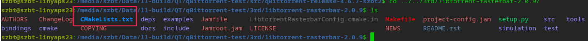
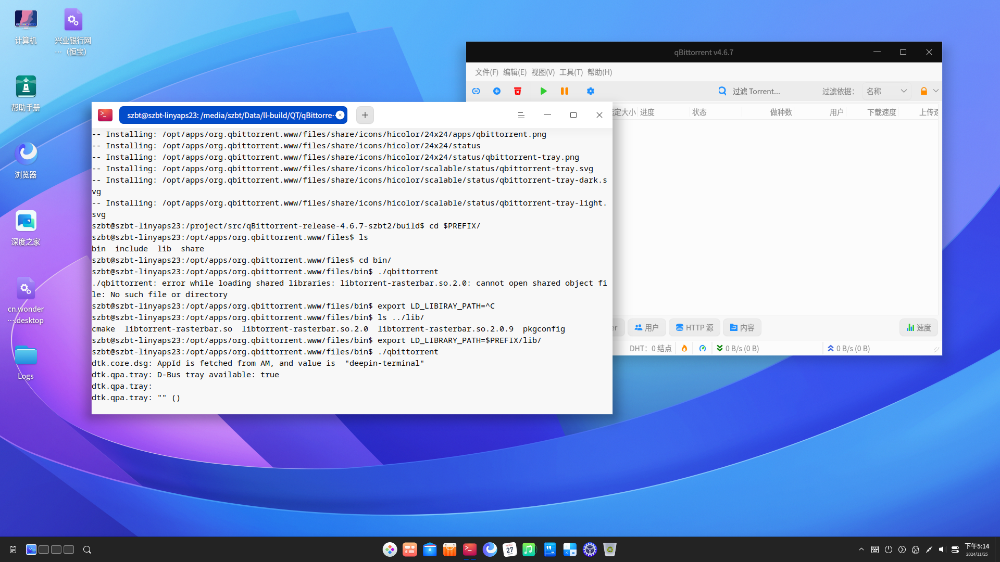

# Compiling Qt5-Based Open Source Application -- qBittorrent in Linyaps Container

After learning the `Basic Knowledge of Linyaps Application Build Projects` in the previous chapter, we are about to enter the practical classroom and use the knowledge we have learned to officially build a Linyaps application.

Today, we will demonstrate how to enter the Linyaps container and compile the source code of an open source graphical application `qBittorrent` into binary files and test its operation.

## Preliminary Preparation

According to the requirements in `Basic Knowledge of Linyaps Application Build Projects` for the `Specifications for General Resources in Linyaps Application Build Projects`, we should provide both `icons` icon files and `desktop` startup files for graphical applications to ensure desktop user experience.

However, this practical classroom will only perform compilation and testing operations in the Linyaps container, so general resources do not need to be prepared temporarily.

This sharing is based on the `deepin 23` distribution, so before performing any of the following steps, you need to prepare a `deepin 23` system environment that can build Linyaps applications:

1. Ensure that the `ll-builder` build suite has been installed in the environment. For installation methods on different distributions, please refer to: [Install Linyaps](https://linyaps.org.cn/guide/start/install.html)

2. Since we need to connect to the network to obtain the runtime libraries of the Linyaps container and possibly needed third-party libraries during the build process, we need to ensure smooth network connection throughout the entire operation process

3. Before compiling through the Linyaps container, you had better successfully compiled `qBittorrent` in `deepin 23` which is relatively close to this build container to ensure you have some understanding of the source code compilation

4. Combine the [Linyaps Application Build Project `linglong.yaml` Specification] in the previous section and simply write a Linyaps build project configuration file `linglong.yaml` according to the following template to generate a container that meets the requirements

The main points to note are: \* Since this operation directly enters the container for operation, the build rules in the `build` part do not need to be written in detail \* Since this compilation operation is involved, in order to include the required runtime libraries to the greatest extent, we add the `runtime` section. For specific writing specifications, please refer to [Basic Knowledge of Linyaps Application Build Projects]

```yaml
# SPDX-FileCopyrightText: 2023 UnionTech Software Technology Co., Ltd.
#
# SPDX-License-Identifier: LGPL-3.0-or-later

version: "4.6.7.2"

package:
  id: org.qbittorrent.qBittorrent
  name: "qBittorrent"
  version: 4.6.7.2
  kind: app
  description: |
    qBittorrent binary

base: org.deepin.foundation/23.0.0
runtime: org.deepin.Runtime/23.0.1

command:
  - /opt/apps/org.qbittorrent.qBittorrent/files/bin/qbittorrent

source:
  - kind: local
    name: "qBittorrent"

build: |
  mkdir -p ${PREFIX}/bin/ ${PREFIX}/share/
```

### Project Compilation Demonstration

\*Here we need to review a knowledge point: According to [Linyaps Application Directory Structure Specification], the build directory at the same level as the build project configuration file `linglong.yaml` will be mapped as the `/project` directory
Everything is ready, we can start compiling

1. For convenience of operation, we open two shell windows in the build directory at the same time, which are used for `Linyaps Container Operation` and `Normal Operation` respectively

2. After completing the preparation of `linglong.yaml` editing, we can start generating the container. Execute limited operations to directly enter the Linyaps container:

```
szbt@szbt-linyaps23:/media/szbt/Data/ll-build/QT/qBittorrent-git$ ll-builder build --exec bash
```

When the path changes similar to the following, it means we have entered the Linyaps container:

```
szbt@szbt-linyaps23:/project$
```

3. Extract the `qBittorrent-4.6.7` source code to the build directory through the `Normal Operation` window. I extracted it to a subdirectory here separately

```
szbt@szbt-linyaps23:/media/szbt/Data/ll-build/QT/qBittorrent-git$ tar -xvf qBittorrent-4.6.7-git-origin-src.tar.zst -C src/
```

4. After the source code is extracted, according to [Basic Steps for Linyaps Application Building], we should correctly choose which compilation system/tools to use before compiling any source code. We observe the `qBittorrent-4.6.7` source code directory and can see that it has a `CMakeLists.txt` file, which is a `CMake` build project.
   

5. Since the [qBittorrent INSTALL](https://github.com/qbittorrent/qBittorrent/blob/release-4.6.7/INSTALL) briefly describes the runtime libraries mainly used by this project, we can compare this document to determine which runtime libraries exist in the `base` and `runtime` provided by Linyaps and which runtime libraries are not provided. For runtime libraries that are not officially provided, we may need to pre-compile the necessary third-party libraries before compiling the main program.

Since the runtime libraries described in the document are few, we can directly perform a test compilation this time to confirm the missing runtime libraries

6. Without delay, we enter the source code directory through the `Linyaps Container Operation` window. In order to avoid interference with the source directory as much as possible, I create a new `build` directory here for compilation. After entering the `build` directory, we enter CMake-related configuration parameters to configure the build project.
   According to [Linyaps Application Directory Structure Specification], we assign the value of `DCMAKE_INSTALL_PREFIX` to `$PREFIX`. Finally, I executed the following operations locally:

```
	cmake -DCMAKE_BUILD_TYPE=Release\
 -DCMAKE_INSTALL_PREFIX=$PREFIX ..
```

7. As can be seen from the figure, an error occurred here that prevented the configuration from being completed. We see that `pkg-config` has an error: the `libtorrent-rasterbar>=1.2.19` library cannot meet the conditions:


```
-- Found PkgConfig: /bin/pkg-config (found version "1.8.1")
-- Checking for module 'libtorrent-rasterbar>=1.2.19'
```

I also cannot obtain relevant information about this library through `pkg-config` alone:

```
szbt@szbt-linyaps23:/project/src/qBittorrent-release-4.6.7-szbt2/build$ pkg-config --print-provides libtorrent-rasterbar
```

Based on this error, we can basically determine that the library is missing, so we need to compile and install this third-party library before compiling the main program

8. We return to the `Normal Operation` window and download the source code corresponding to the `libtorrent-rasterbar>=1.2.19` library to the current build directory. Enter the `Linyaps Container Operation` window to recompile

9. After the source code is extracted, according to [Basic Steps for Linyaps Application Building], we should correctly choose which compilation system/tools to use before compiling any source code. We observe the `libtorrent-rasterbar-2.0.9` source code directory and can see that it has a `CMakeLists.txt` file, which is a `CMake` build project.



10. We enter the source code directory through the `Linyaps Container Operation` window. In order to avoid interference with the source directory as much as possible, I create a new `build` directory here for compilation. After entering the `build` directory, we enter CMake-related configuration parameters to configure the build project.
    According to [Linyaps Application Directory Structure Specification], we assign the value of `DCMAKE_INSTALL_PREFIX` to `$PREFIX`. Finally, I executed the following operations locally:

```
	cmake -DCMAKE_BUILD_TYPE=Release\
 -DCMAKE_INSTALL_PREFIX=$PREFIX ..
	make -j$(nproc)
	make install
```

As can be seen, the third-party library `libtorrent-rasterbar-2.0.9` was successfully compiled and installed into the `$PREFIX` directory in the container. We can start the next operation

11. We return to the `Linyaps Container Operation` window and enter the `qBittorrent-4.6.7` source code directory. Re-execute the configuration, compilation, and installation operations. No errors exist.

### Compilation Result Testing

After the process ends, we find the binary executable file of this project in the `$PREFIX` directory `/opt/apps/org.qbittorrent.qBittorrent/files/bin/qbittorrent` and run the test in the container. \* This operation needs to be performed in the terminal of the graphical desktop, otherwise the graphical interface of the program may not be invoked

It seems that because it is not directly started through the container, there is a problem that the runtime library cannot be found. Since the reported library is also in $PREFIX, we directly use the variable `LD_LIBRARY_PATH` to specify the dynamic runtime library search path



So far, it is sufficient to prove that `Qt5-based open source application--qBittorrent` can be successfully compiled and run in the `Linyaps` application container!
