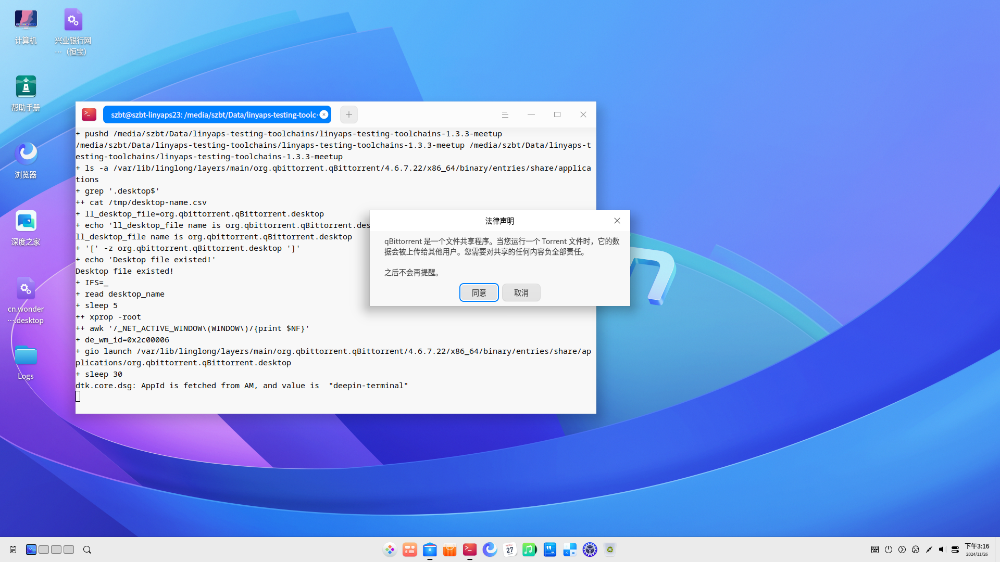
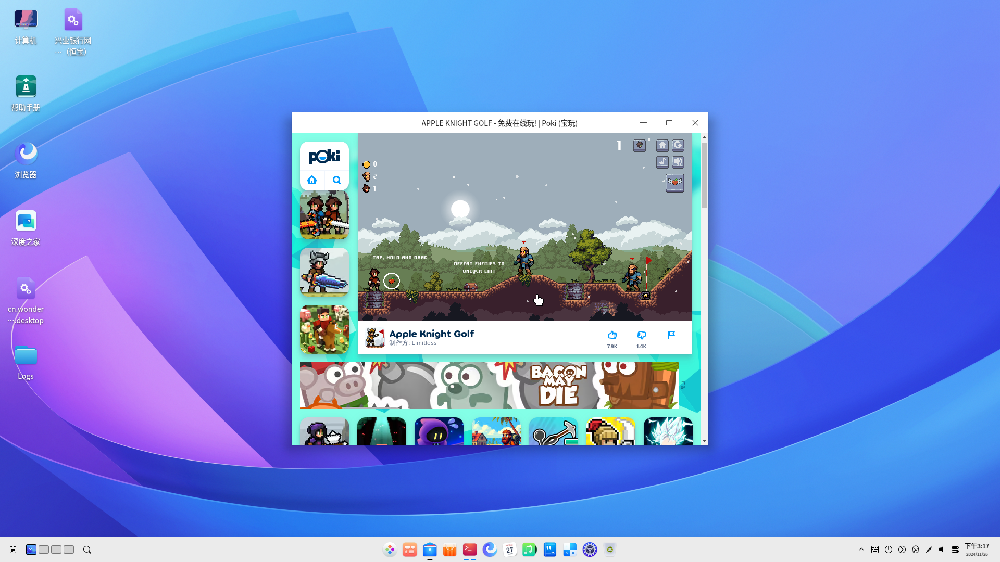
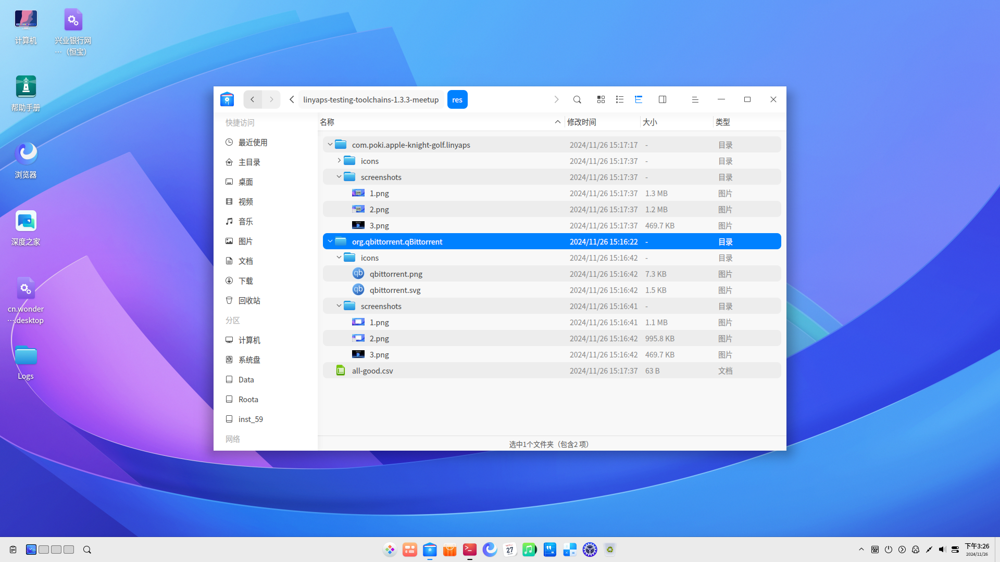

# Advanced Linyaps Application Compatibility Testing -- Linyaps Application Automated Testing Suite

As you may have noticed, in our previous Linyaps application compilation, we manually installed packages and launched applications to test compatibility
However, this raises a question: as the number of applications that need testing continues to increase, doesn't the manual testing approach seem relatively inefficient?
To address this, I would like to introduce to you the `Linyaps Application Automated Testing Suite -- Next Linyaps Testing Toolchains` currently available to ecosystem contributors in the Linyaps community

## Project Introduction

`Next Linyaps Testing Toolchains` is a Linyaps application testing toolchain composed of shell scripts, designed to bring more convenient solutions for Linyaps application testing
This project is the legitimate spiritual successor of [linglong-automan](https://gitee.com/ziggy615/linglong-automan) and promises to remain open source forever

## Implemented Features

1. Organize scattered `*binary.layer` files in a specified directory into a standardized directory structure: `xxx/id/package` and generate two tables storing Linyaps application IDs and application version numbers

2. After specifying the organized Linyaps file storage directory, start the streamlined installation process

3. After specifying the resource storage directory and application information table, simulate launching applications through desktop files based on `installation status`, `desktop file existence status`, and `window generation status`, and take screenshots of test results \* The current code partially depends on `deepin 23` system components and needs to be re-adapted when used on other distributions

4. Scan icon files for installed Linyaps applications, determine whether the current application icons directory and files comply with `Freedesktop XDG` specifications, and collect icons

5. Batch uninstall installed Linyaps applications

## Code Structure Analysis

Entering the suite repository, you can see that the suite is divided into several key independent scripts according to function/role, roughly:

1. `linyaps-auto-optimize.sh`, Linyaps application installation package `binary.layer` organization tool. Organize all `binary.layer` files in a directory into a structure suitable for the testing suite and produce two tables for recording Linyaps application IDs and version numbers, such as:

```
org.qbittorrent.qBittorrent/package/org.qbittorrent.qBittorrent_4.6.7.22_x86_64_binary.layer
com.poki.apple-knight-golf.linyaps/package/com.poki.apple-knight-golf.linyaps_28.3.3.2_x86_64_binary.layer
```

ll-pkg-name.csv

```
org.qbittorrent.qBittorrent
com.poki.apple-knight-golf.linyaps
```

ll-pkg-version.csv

```
4.6.7.22
28.3.3.2
```

2. `linyaps-auto-install-release.sh`, Linyaps application installation package `binary.layer` batch installation tool, used to install packages organized by `linyaps-auto-optimize.sh`

3. `linyaps-auto-screenshot-deepin23.sh`, application automated testing suite, including running status screenshot function, only for `deepin 23` environment

4. `linyaps-auto-screenshot-general.sh`, application automated testing suite general version, does not include running status screenshot function, for non-deepin 23 environments

5. `linyaps-auto-uninstall-release.sh`, Linyaps application batch uninstallation tool

## Next Linyaps Testing Toolchains Practical Application

After introducing the overall functions and code logic, we demonstrate how to complete batch testing of Linyaps application installation packages `binary.layer` produced in previous lessons through the `Linyaps Application Automated Testing Suite` based on `deepin 23`

### Environment Preparation

Before starting to use the testing suite, you need to ensure that the current environment meets the following conditions

1. Some functions of the self-service compatibility testing suite used in this practical demonstration require the use of `Linux x11` window management tools, so you need to install the following software packages before use:

```
wmctrl x11-utils
```

2. The testing suite uses x11 window management tools to determine application window startup status, so you need to ensure that your system is an `x11` environment rather than a `Wayland` environment

3. `wmctrl` and `xwininfo` components can work normally, and window information can be queried through `xwininfo`

4. Since `deepin 23` provides compatibility testing result screenshot function, you need to install related software packages:

```
deepin-screen-recorder imagesmagick-6.q16
```

5. Manually start `deepin-screen-recorder` once to ensure that the system screenshot save path is in the current user's ~/Pictures/Screenshots, and the directory is empty

### Start Testing Function

1. In the previous practical lesson, we obtained the Linyaps installation package `org.qbittorrent.qBittorrent_4.6.7.22_x86_64_binary.layer` for `qBittorrent--4.6.7`. For convenience in demonstrating the suite's batch support capability, I separately found another installation package here

2. Now we have two Linyaps application installation packages. First execute the `linyaps-auto-optimize.sh` script to organize the directory
   This script mainly uses two parameters to point to the current directory storing Linyaps application installation packages `binary.layer` `$ll_origin_pool` and the destination directory that needs to be organized `$ll_stored_pool`

3. I created two separate directories `ll-bins` `ll-pool` locally to point to `$ll_origin_pool` and `$ll_stored_pool`
   The current directory structure of `ll-bins`:

```
├── ll-bins
│   ├── org.qbittorrent.qBittorrent_4.6.7.22_x86_64_binary.layer
│   └── com.poki.apple-knight-golf.linyaps_28.3.3.2_x86_64_binary.layer
```

4. Execute directory organization operation

```bash
ziggy@linyaps23:/media/szbt/Data/linyaps-testing-toolchains$ ./linyaps-auto-optimize.sh ./ll-bins ./ll-pool
```

After the organization is completed, the directory presents this structure:

```
ll-pool/
├── org.qbittorrent.qBittorrent
│   └── package
│       └── org.qbittorrent.qBittorrent_4.6.7.22_x86_64_binary.layer
└── com.poki.apple-knight-golf.linyaps
    └── package
        └── com.poki.apple-knight-golf.linyaps_28.3.3.2_x86_64_binary.layer

```

5. After the directory organization, two tables `ll-pkg-name.csv` `ll-pkg-version.csv` are generated to record application information. We merge the two columns into a new table `ll-pkg-info.csv`:

ll-pkg-info.csv

```
org.qbittorrent.qBittorrent,4.6.7.22
com.poki.apple-knight-golf.linyaps,28.3.3.2
```

6. Based on this file, we can start batch installing Linyaps applications
   This script mainly uses one parameter to point to the current organized destination directory `$ll_stored_pool`:

```bash
ziggy@linyaps23:/media/szbt/Data/linyaps-testing-toolchains$ linyaps-auto-install-release.sh ./ll-pool
```

7. After installing the Linyaps applications and completing all prerequisite work, we can start the testing process. Here we create a new `res` directory to store test result resources such as icons and screenshots

8. Open a terminal in the graphical interface and execute the screenshot script. Since we are in a `deepin 23 x11` environment and have installed the necessary programs, we run `linyaps-auto-screenshot-deepin23.sh`
   This script mainly uses two parameters to point to the directory for placing test result resources `$ll_res_pool` and the table recording application information `$ll_pkgname_list`. Here it refers to the new table `ll-pkg-info.csv` we obtained in the previous step:

```bash
ziggy@linyaps23:/media/szbt/Data/linyaps-testing-toolchains$ ./linyaps-auto-screenshot-deepin23.sh ./res ./ll-pkg-info.csv
```

\* Remember, this script must be executed in a graphical terminal, otherwise the process cannot be properly launched

9. After the script starts, minimize the terminal window and keep it running in the background. The testing suite will judge the application installation status and desktop file existence status to `start` and `close` application windows




10. After meeting the running requirements, the suite will simulate launching the program through the desktop file and judge the window after about 30s delay, checking whether the application generates a new window after running




11. After the application runs successfully, it will complete screenshot, icon detection & acquisition operations in sequence

12. After the test is completed, you can see tables of different statuses and test result materials in the `res` directory. Since both applications here passed the compatibility test, they will be recorded in `all-good.csv`
    Otherwise, two abnormal situations will occur:
    a. Applications that timeout without generating windows will be written into the `failed.csv` file, judged as applications that cannot be launched
    b. If the Linyaps application directory does not contain icon files, it will be written into the `icons-missing.csv` file, not meeting the specifications for graphical applications in the Linyaps community

```
res/
├── all-good.csv
├── com.poki.apple-knight-golf.linyaps
│   ├── icons
│   │   └── com.poki.apple-knight-golf.png		##Application icon file
│   └── screenshots	##Application compatibility test screenshots
│       ├── 1.png
│       ├── 2.png
│       └── 3.png
└── org.qbittorrent.qBittorrent
    ├── icons
    │   ├── qbittorrent.png
    │   └── qbittorrent.svg
    └── screenshots
        ├── 1.png
        ├── 2.png
        └── 3.png
```



So far, we have successfully completed compatibility testing of Linyaps applications produced in previous lessons through the Linyaps Application Automated Testing Suite
