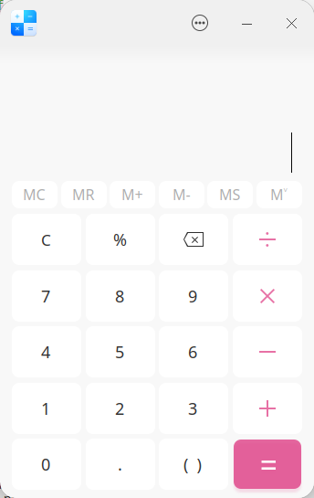

<!--
SPDX-FileCopyrightText: 2024 UnionTech Software Technology Co., Ltd.

SPDX-License-Identifier: LGPL-3.0-or-later
-->

# Build Your First Linyaps Application

Using [deepin-calculator](https://github.com/linuxdeepin/deepin-calculator.git) as an example, this guide introduces the process of building a Linyaps package from source code.

Linyaps applications need to use reverse domain name notation for their appid.

## Create Project

```bash
mkdir org.deepin.calculator
```

Create a linglong.yaml file in the directory

```bash
touch org.deepin.calculator/linglong.yaml
```

Enter the directory

```bash
cd org.deepin.calculator
```

Edit linglong.yaml using a text editor

```bash
version: '1'

package:
  id: org.deepin.calculator
  name: deepin-calculator
  version: 5.7.21.0
  kind: app
  description: |
    calculator for deepin os.

command:
  - /opt/apps/org.deepin.calculator/files/bin/deepin-calculator

base: org.deepin.base/23.1.0
runtime: org.deepin.runtime.dtk/23.1.0

sources:
  - kind: git
    url: https://github.com/linuxdeepin/deepin-calculator.git
    version: master
    commit: d7e207b4a71bbd97f7d818de5044228c1a6e2c92

  - kind: git
    url: https://github.com/linuxdeepin/dde-qt-dbus-factory.git
    version: master
    commit: d952e1913172c5507af080f644a654f9ba5fed95

build: |
  # build dde-qt-dbus-factory
  cd /project/linglong/sources/dde-qt-dbus-factory.git
  qmake -makefile \
        PREFIX=${PREFIX} \
        LIB_INSTALL_DIR=${PREFIX}/lib/${TRIPLET} \
        INSTALL_ROOT=${PREFIX}

  make
  make install

  # build calculator
  cd /project/linglong/sources/deepin-calculator.git
  cmake -Bbuild \
        -DCMAKE_INSTALL_PREFIX=${PREFIX} \
        -DCMAKE_INSTALL_LIBDIR=${PREFIX}/lib/${TRIPLET} \
        -DCMAKE_BUILD_TYPE=Release \
        -DCMAKE_SAFETYTEST_ARG="CMAKE_SAFETYTEST_ARG_OFF" \
        -DAPP_VERSION=5.7.21 \
        -DVERSION=5.7.21

  cmake --build build
  cmake --build build --target install
```

The linglong.yaml file follows YAML syntax specifications.

For detailed explanation of fields in linglong.yaml, refer to: [Build Configuration File Introduction](../building/manifests.md)

## Build

```bash
ll-builder build
```

Wait for the Linyaps application to finish building.

## Run Linyaps Application

```bash
ll-builder run
```

Successful output from `ll-builder run` is as follows:



For debugging convenience, you can use the additional `--exec /bin/bash` parameter to replace the default program executed after entering the container

```bash
ll-builder run --exec /bin/bash
```

<br>
<br>

# Convert deb Application

Using Baidu Netdisk as an example, this introduces the process of converting a deb package to a Linyaps package.

## Get Software Package

First obtain the deb package file. Currently only supports converting software that follows application store packaging specifications.

```bash
apt download com.baidu.baidunetdisk
```

## Convert Application

```bash
ll-pica convert -c com.baidu.baidunetdisk_4.17.7_amd64.deb -w work -b --exportFile layer
```

Enter the directory

```bash
cd work/package/com.baidu.baidunetdisk/amd64
```

## Install layer file

```bash
ll-cli install ./com.baidu.baidunetdisk_4.17.7.0_x86_64_runtime.layer
```

## Run Application

```
ll-cli run com.baidu.baidunetdisk
```

Successful run output is as follows:


# Video Links

[Tongxin Alliance "Development Empowerment to Build Linyaps Ecosystem" Sharing Live Conference Replay Video](https://www.bilibili.com/video/BV1ff421R7aY)
