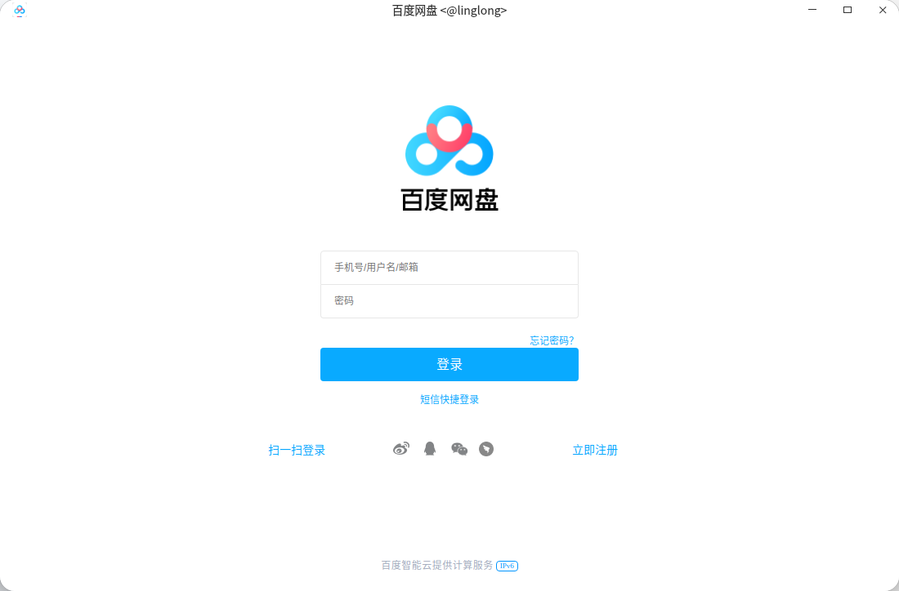

<!--
SPDX-FileCopyrightText: 2026 UnionTech Software Technology Co., Ltd.

SPDX-License-Identifier: LGPL-3.0-or-later
-->

# 使用 ll-pica 转换 deb 应用

本章以百度网盘为例，介绍如何使用 `ll-pica` 将 deb 软件包转换为如意玲珑应用。目前仅支持转换符合应用商店打包规范的软件包。

开始前，请按照[安装如意玲珑](../start/install.md)安装 `ll-pica`、`ll-builder` 和 `ll-cli`，并确认命令可用：

```bash
ll-pica --help
ll-builder --version
ll-cli --version
```

## 获取 deb 软件包

使用 `apt download` 下载软件包：

```bash
apt download com.baidu.baidunetdisk
```

执行转换前，请确认下载得到的文件名和版本。下面的示例使用 `com.baidu.baidunetdisk_4.17.7_amd64.deb`。

## 转换应用

执行：

```bash
ll-pica convert -c com.baidu.baidunetdisk_4.17.7_amd64.deb -w work -b --exportFile layer
```

参数的完整说明见 [`ll-pica convert`](../reference/commands/ll-pica/ll-pica-convert.md)。转换完成后，进入生成的项目目录：

```bash
cd work/package/com.baidu.baidunetdisk/amd64
```

在安装前检查生成的 `linglong.yaml`，确认应用 ID、版本、Base、Runtime、启动命令和构建产物符合预期。配置字段见[构建配置文件简介](./manifests.md)。

## 安装转换结果

安装生成的 layer 文件：

```bash
ll-cli install ./com.baidu.baidunetdisk_4.17.7.0_x86_64_runtime.layer
```

实际文件名可能随应用版本和目标架构变化，请以转换目录中的文件为准。

## 运行验证

```bash
ll-cli run com.baidu.baidunetdisk
```

运行成功后会显示应用窗口：



如果应用无法运行，请先检查生成的启动命令和缺失依赖，再查阅 [`ll-pica` 常见问题](../tips-and-faq/ll-pica-faq.md)。

## 手动整理应用目录

`ll-pica` 适合生成初始配置。需要手动转换时，应将 deb 内容整理为如意玲珑应用目录：

- 可执行文件和应用私有库安装到 `${PREFIX}`；
- desktop 文件、图标等桌面集成资源安装到 `${PREFIX}/share`；
- `linglong.yaml` 中的 `command` 指向实际安装的可执行文件；
- 应用不能依赖宿主机 `/usr` 中未由 Base 或 Runtime 提供的文件。

目录与打包要求见[玲珑应用打包规范](./linyaps_package_spec.md)。不使用 `ll-pica` 时，参阅[手动从 deb 转换](./deb_conversion.md)。
