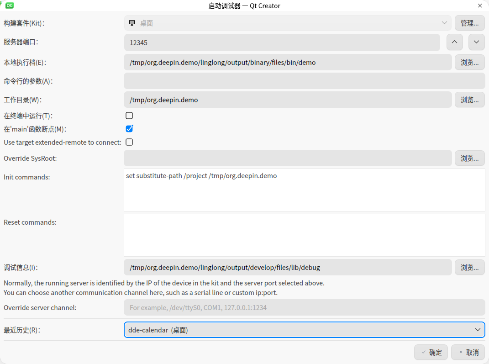

<!--
SPDX-FileCopyrightText: 2023 UnionTech Software Technology Co., Ltd.

SPDX-License-Identifier: LGPL-3.0-or-later
-->

# 调试玲珑应用

以下教程以“构建工具”一节中提到的 org.deepin.demo 项目为例。

我们将项目放在 `/tmp`。参考教程操作时**注意对路径进行替换**。

## 在终端中使用 gdb 进行调试

### 在调试环境运行应用

在 [运行编译后的应用](../ll-builder/run.md) 一节中，我们已经知道使用`ll-builder run --exec /bin/bash`可以运行编译后的应用并进入容器的终端。只需要再 run 后面加上 `--debug` 参数即可以调试环境运行容器并进入容器。调试环境和非调试环境的区别主要有以下几点：

1. 调试环境会使用 base 和 runtime 的 binary+develop 模块，而非调试环境会使用 binary 模块，gdb 工具就在 base 的 develop 模块中。
2. 调试环境会使用 app 的 binary+develop 模块，而非调试环境默认使用 binary 模块（一般会将应用的调试符号保存到 develop 模块）。
3. 调试环境会在项目目录生成 linglong/gdbinit 文件并挂载到容器中的 ~/.gdbinit 路径。

请在项目目录执行`ll-builder run --debug --exec /bin/bash` 进入调试环境容器，然后执行 `gdb /opt/apps/org.deepin.demo/binary/demo` 启动应用的调试，和在外部使用命令行调试并无区别，这得益于调试 linglong/gdbinit 文件为 `gdb` 提供了初始配置。

### 在运行环境调试应用

调试环境和用户正常使用的运行环境是存在小部分差异的，如果需要直接在运行环境中调试应用，可以使用 `ll-builder run --exec /bin/bash` 进入容器，然后执行 `gdbserver 127.0.0.1:12345 /opt/apps/org.deepin.demo/binary/demo` ，gdbserver 会使用 tcp 协议监听 12345 端口并等待 gdb 连接。

再打开一个宿主机终端，在项目目录执行 `gdb`，按行输入以下指令：

```txt
set substitute-path /project /tmp/org.deepin.demo
set debug-file-directory /tmp/org.deepin.demo/linglong/output/develop/files/lib/debug
target remote 127.0.0.1:12345
```

即可使用 gdb 通过 tcp 协议连接到运行环境中的 gdbserver 调试应用。使用`ll-cli run $appid --exec /bin/bash` 也可使用 gdbserver

_如果运行环境没有 gdbserver 命令，请检查应用是否使用 org.deepin.base 作为 base，尝试升级到最新版本的 org.deepin.base。_

## 在 vscode 中使用 gdb 进行调试

首先给 vscode 安装 C/C++ 插件，因为 vscode 是运行在宿主机上的，所以也需要通过 gdbserver 来为玲珑容器中的应用提供调试。和上个步骤一样，先在运行环境中启动 gdbserver，然后 vscode 配置好 launch.json 文件即可。具体配置如下：

```json
{
  "version": "0.2.0",
  "configurations": [
    {
      "name": "(gdb) linglong",
      "type": "cppdbg",
      "request": "launch",
      "program": "${workspaceFolder}/linglong/output/binary/files/bin/demo",
      "args": [],
      "stopAtEntry": true,
      "cwd": "${workspaceFolder}",
      "MIMode": "gdb",
      "miDebuggerServerAddress": "127.0.0.1:12345",
      "setupCommands": [
        {
          "text": "set substitute-path /project ${workspaceFolder}"
        },
        {
          "text": "set debug-file-directory ${workspaceFolder}/linglong/output/develop/files/lib/debug"
        }
      ]
    }
  ]
}
```

部分配置需要按照项目实际情况更改：

- "program": "${workspaceFolder}/linglong/output/binary/files/bin/demo",

  这是传递给 gdb 的二进制文件，`demo` 需要更改为项目实际的二进制文件名

- "stopAtEntry": true

  这是要求 gdb 在 main 函数自动停止，如果不需要可以设置为 false

- "miDebuggerServerAddress": "127.0.0.1:12345"

  这是 gdb 连接的远程地址，在启动 gdbserver 时如果端口不是默认的 12345，需要修改为实际端口。

- "text": "set substitute-path /project ${workspaceFolder}"

  这是设置源码路径的替换，`${workspaceFolder}` vscode 会自动替换成当前工作目录，如果需要更改为实际路径可以修改。

- "text": "set debug-file-directory ${workspaceFolder}/linglong/output/develop/files/lib/debug"

  这里是设置调试文件的目录，如果调试符号没有保存到`develop`模块，需要修改为实际位置。

## 在 Qt Create 中使用 gdb 进行调试

Qt Create 也集成了对 gdb 的支持，启动 Qt Create 后打开菜单栏中的 `调试` -> `开始调试` -> `连接到正在运行的调试服务器`，在弹出的对话框中填入：

```text
服务器端口：`12345`

本地执行档案：`/tmp/org.deepin.demo/linglong/output/binary/files/bin/demo`

工作目录：`/tmp/org.deepin.demo`

Init Commands: `set substitute-path /project /tmp/org.deepin.demo`

调试信息：`/tmp/org.deepin.demo/linglong/output/develop/files/lib/debug`
```

大致配置如下图所示：



配置完成后，即可正常使用`QtCreator`来进行调试了。

## 保存调试符号

玲珑在构建应用后会自动剥离二进制的调试符号，并存放到 `$PREFIX/lib/debug` 目录，但是一些工具链会在构建时提前将调试符号剥离，这会导致玲珑无法在二进制文件中找到这些符号，如果你的项目是使用 qmake，需要在 pro 文件中添加以下配置

```
# 玲珑在CFLAGS和CXXFLAGS环境变量里设置了-g选项，这里需要qmake继承这个环境变量
QMAKE_CFLAGS += $$(CFLAGS)
QMAKE_CXXFLAGS += $$(CXXFLAGS)
# 使用debug选项避免qmake自动剥离调试符号
CONFIG += debug
```

cmake 会自动使用 cflags 和 cxxflags 环境变量，所以不需要额外配置。其他构建工具可自定查询文档。
