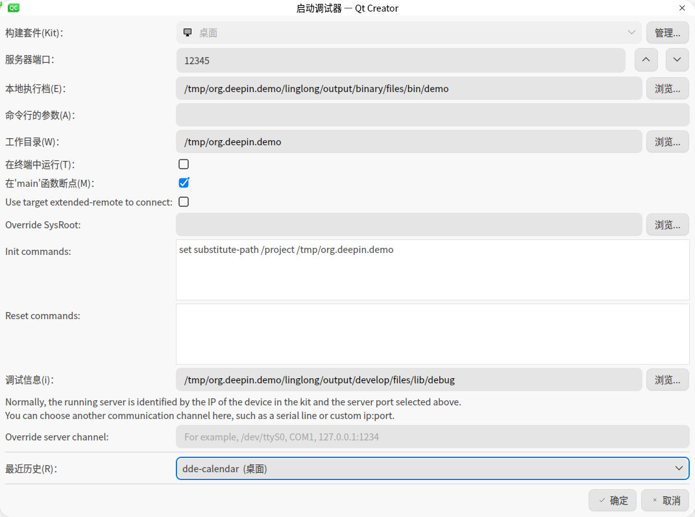

<!--
SPDX-FileCopyrightText: 2023 UnionTech Software Technology Co., Ltd.

SPDX-License-Identifier: LGPL-3.0-or-later
-->

# 调试如意玲珑应用

以下教程以应用 ID 为 `org.deepin.demo` 的示例项目为例。先按照下面的步骤准备并构建应用，再进行后续调试。实际调试自己的应用时，请将应用 ID、可执行文件和项目路径替换为当前项目的对应值。

## 准备调试示例

### 创建项目

在 `/tmp` 中创建 `org.deepin.demo` 项目：

```bash
cd /tmp
ll-builder create org.deepin.demo
cd org.deepin.demo
```

`ll-builder create` 会生成 `/tmp/org.deepin.demo/linglong.yaml`。后续调试命令均以该目录为项目根目录。

### 配置 linglong.yaml

将生成的 `linglong.yaml` 修改为：

```yaml
version: "1"

package:
  id: org.deepin.demo
  name: demo
  kind: app
  version: 1.0.0.0
  description: |
    A simple demo app.

command:
  - demo

base: org.deepin.base/23.1.0
runtime: org.deepin.runtime.dtk/23.1.0

sources:
  - kind: git
    url: "https://github.com/linuxdeepin/linglong-builder-demo.git"
    commit: master
    name: linglong-builder-demo

build: |
  cd /project/linglong/sources/linglong-builder-demo
  rm -rf build || true
  mkdir build
  cd build
  qmake PREFIX=${PREFIX} ..
  make
  make install
```

该配置从 `linglong-builder-demo` 获取 qmake 示例源码，在构建容器中完成编译和安装。后续教程使用的应用 ID、可执行文件名和调试符号路径均与这份配置对应。

### 构建并验证

在 `/tmp/org.deepin.demo` 中执行：

```bash
ll-builder build
ll-builder run
```

确认应用可以正常运行后再开始调试。如果构建失败，请先解决构建问题；调试命令只能使用已经成功生成的构建产物。

## 在终端中使用 gdb 进行调试

### 在调试环境下运行应用

使用 `ll-builder run -- bash` 可以进入应用程序所在容器的运行环境中。在命令中增加 `--debug` 参数，即可以调试模式运行容器。调试环境和非调试环境的区别主要有以下几点：

1. 调试环境会使用 base 和 runtime 的 binary+develop 模块，而非调试环境仅启用 binary 模块，gdb 等调试工具在 base 的 develop 模块中提供。
2. 调试环境会使用 app 的 binary+develop 模块，而非调试环境默认使用 binary 模块（一般会将应用的调试符号保存到 develop 模块）。
3. 调试环境会在项目目录生成 linglong/gdbinit 文件并挂载到容器中的 ~/.gdbinit 路径。

请在项目目录执行 `ll-builder run --debug -- bash` 进入调试环境容器，然后执行 `gdb /opt/apps/org.deepin.demo/files/bin/demo` 启动应用调试。其操作方式与在宿主机使用命令行调试相同，`linglong/gdbinit` 会为 `gdb` 提供所需的初始配置。

### 在运行环境下调试应用

调试环境和用户的运行环境存在一些差异。如果需要在正式环境中调试应用，可以使用 `ll-cli run --debug` 进行调试。

先将构建结果导出并安装，确保应用已经安装，因为 `ll-cli run` 只能运行已经安装的应用。

在 `/tmp/org.deepin.demo` 项目目录中执行以下命令，将构建结果[导出](../reference/commands/ll-builder/export.md)为 UAB 文件：

```bash
ll-builder export --ref main:org.deepin.demo/1.0.0.0/<arch> --modules binary,develop
```

其中 `<arch>` 是构建产物的目标架构，例如 `x86_64`、`arm64` 或 `loong64`。请通过 `ll-builder list` 查看构建结果，并将命令中的 ref 替换为列表显示的完整值。这里同时导出了 binary 和 develop 模块，是为了演示方便，因为调试符号一般在 develop 模块内。正常的分发流程下，一般将 binary 模块分发，develop 模块留档用以后续的调试。

接着 [安装](../reference/commands/ll-cli/install.md)导出的 UAB 文件：

```bash
ll-cli install ./org.deepin.demo_1.0.0.0_<arch>_main.uab
```

将文件名中的 `<arch>` 替换为实际目标架构，或者直接使用导出命令生成的文件名。确认安装成功后，使用 `ll-cli run --debug` 启动应用：

```bash
ll-cli run --debug org.deepin.demo
```

`--debug` 会通过 gdbserver 启动应用，并默认监听 2345 端口，无需先进入容器手动运行 gdbserver。如需指定监听地址和端口，可以执行：

```bash
ll-cli run --debug --debug-listen 127.0.0.1:12345 org.deepin.demo
```

运行后，终端会显示如下的提示：

```
Debug mode is enabled. Attach from another terminal with:
  /tmp/linglong-gdb-30e29611-ed83-4032-bd77-aab8a709802d.sh

Generated gdb attach script:
------------------------------------------------------------
#!/bin/sh
set -- -ex 'target remote localhost:2345' "$@"
set -- -ex 'set debug-file-directory /usr/lib/debug:/runtime/lib/debug:/opt/apps/org.deepin.demo/files/lib/debug' "$@"
exec gdb "$@"
------------------------------------------------------------
============================================================
Listening on port 2345
```

再打开一个宿主机终端，运行提示中的 `/tmp/linglong-gdb-30e29611-ed83-4032-bd77-aab8a709802d.sh` 辅助脚本，即可通过 gdb 连接到运行环境中的 gdbserver 进行调试。

如果需要对 Base 或 Runtime 中提供的二进制进行调试，可以使用 deepin 社区提供的 debuginfod 服务，通过添加参数 `--debug-debuginfod https://debuginfod.deepin.com` 开启，注意宿主机 gdb 版本需要 10 以上。

上述的配置完成后正常情况已经有了符号，可以在具体的符号上下断点观察。如果需要源码级调试，只需在 gdb 内设置源码的替换路径即可，比如：

```txt
set substitute-path /project /tmp/org.deepin.demo
```

前面的 `/project` 是项目目录在构建环境的路径，后面的 `/tmp/org.deepin.demo` 是项目目录在宿主机上的路径，通过 `info source` 可以查看具体的源码信息。

## 在 vscode 中使用 gdb 进行调试

首先给 vscode 安装 C/C++ 插件，因为 vscode 是运行在宿主机上的，所以也需要通过 gdbserver 来为如意玲珑容器中的应用提供调试。和上个步骤一样，先执行 `ll-cli run --debug --debug-listen 127.0.0.1:12345 org.deepin.demo` 启动应用和 gdbserver，然后 vscode 配置好 launch.json 文件即可。具体配置如下：

```json
{
  "version": "0.2.0",
  "configurations": [
    {
      "name": "(gdb) linglong",
      "type": "cppdbg",
      "request": "launch",
      "program": "${workspaceFolder}/linglong/output/binary/files/bin/demo",
      "args": [],
      "stopAtEntry": true,
      "cwd": "${workspaceFolder}",
      "MIMode": "gdb",
      "miDebuggerServerAddress": "127.0.0.1:12345",
      "setupCommands": [
        {
          "text": "set substitute-path /project ${workspaceFolder}"
        },
        {
          "text": "set debug-file-directory ${workspaceFolder}/linglong/output/develop/files/lib/debug"
        }
      ]
    }
  ]
}
```

部分配置需要按照项目实际情况更改：

- "program": "${workspaceFolder}/linglong/output/binary/files/bin/demo",

  这是传递给 gdb 的二进制文件，`demo` 需要更改为项目实际的二进制文件名

- "stopAtEntry": true

  这是要求 gdb 在 main 函数自动停止，如果不需要可以设置为 false

- "miDebuggerServerAddress": "127.0.0.1:12345"

  这是 gdb 连接的远程地址，在启动 gdbserver 时如果端口不是默认的 12345，需要修改为实际端口。

- "text": "set substitute-path /project ${workspaceFolder}"

  这是设置源码路径的替换，`${workspaceFolder}` vscode 会自动替换成当前工作目录，如果需要更改为实际路径可以修改。

- "text": "set debug-file-directory ${workspaceFolder}/linglong/output/develop/files/lib/debug"

  这里是设置调试文件的目录，如果调试符号没有保存到`develop`模块，需要修改为实际位置。

## 在 Qt Create 中使用 gdb 进行调试

Qt Create 也集成了对 gdb 的支持，启动 Qt Create 后打开菜单栏中的 `调试` -> `开始调试` -> `连接到正在运行的调试服务器`，在弹出的对话框中填入：

```text
服务器端口：`12345`

本地执行档案：`/tmp/org.deepin.demo/linglong/output/binary/files/bin/demo`

工作目录：`/tmp/org.deepin.demo`

Init Commands: `set substitute-path /project /tmp/org.deepin.demo`

调试信息：`/tmp/org.deepin.demo/linglong/output/develop/files/lib/debug`
```

大致配置如下图所示：



配置完成后，即可正常使用`QtCreator`来进行调试了。

## 保存调试符号

如意玲珑在构建应用后会自动剥离二进制的调试符号，并存放到 `$PREFIX/lib/debug` 目录，但是一些工具链会在构建时提前将调试符号剥离，这会导致如意玲珑无法在二进制文件中找到这些符号，如果你的项目是使用 qmake，需要在 pro 文件中添加以下配置

```bash
# 如意玲珑在CFLAGS和CXXFLAGS环境变量里设置了-g选项，这里需要qmake继承这个环境变量
QMAKE_CFLAGS += $$(CFLAGS)
QMAKE_CXXFLAGS += $$(CXXFLAGS)
# 使用debug选项避免qmake自动剥离调试符号
CONFIG += debug
```

cmake 会自动使用 cflags 和 cxxflags 环境变量，所以不需要额外配置。其他构建工具可自定查询文档。

## 从debian仓库下载调试符号

默认 `ll-cli run ` 的 debug 模式会自动下载 base 的 develop 模块，如果配置了 debuginfod，调试时会自动下载能够匹配的符号。如果由于某些原因无法匹配，可以从 base 对应的 debian 仓库手动下载调试符号包。具体步骤如下：

1. 使用以下命令之一进入容器命令行环境:

   ```bash
   ll-builder run -- bash
   # 或
   ll-cli run $appid -- bash
   ```

2. 查看base镜像使用的仓库地址:

   ```bash
   cat /etc/apt/sources.list
   ```

3. 在宿主机浏览器中打开仓库地址，定位依赖库的deb包所在目录:
   - 使用命令 `apt-cache show <package-name> | grep Filename` 查看deb包在仓库中的路径
   - 完整的下载地址为: 仓库地址 + deb包路径

   例如，要下载libgtk-3-0的调试符号包:

   ```bash
   apt-cache show libgtk-3-0 | grep Filename
   # 输出: pool/main/g/gtk+3.0/libgtk-3-0_3.24.41-1deepin3_amd64.deb
   # 完整目录: <repo-url>/pool/main/g/gtk+3.0/
   ```

4. 在该目录下寻找对应的调试符号包，通常有两种命名格式:
   - `<package-name>-dbgsym.deb`
   - `<package-name>-dbg.deb`

5. 下载并解压调试符号包:

   ```bash
   dpkg-deb -R <package-name>-dbgsym.deb /tmp/<package-name>
   ```

6. 配置调试器查找调试符号:
   在上面的场景设置debug-file-directory时，追加解压的目录，用冒号分隔:
   ```
   ${workspaceFolder}/linglong/output/develop/files/lib/debug:/tmp/<package-name>/usr/lib/debug
   ```

这样调试器就能在解压的目录中找到系统依赖库的调试符号了。
