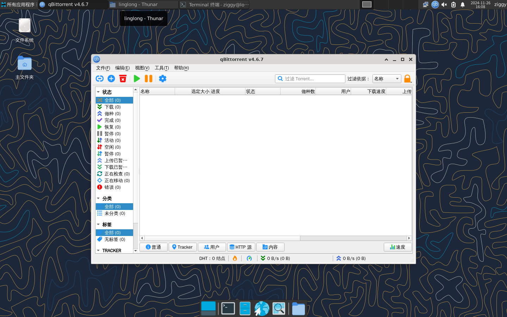

# 将基于Qt5的开源应用--qBittorrent 适配为支持自动化的玲珑应用构建工程
书接上文, 我们继续探讨如何将 `linglong.yaml` 适配为支持自动构建的版本
由于上一环节我们已经确定了可以正常完成编译构建任务所使用的构建规则, 因此我们本节主要讨论如何利用 `git` 功能完成下列自动操作

1. 自动拉取开源项目git仓库资源
2. 自动应用自定义patch内容

## 改造 `linglong.yaml`
在上一节中我们已经获得了可以成功编译本地源代码的 `linglong.yaml`, 由于是同一款应用项目, 我们可以直接在其基础上进行改造

对于 `linglong.yaml` 而言, 核心部分之二主要是 `sources` 和 `build` 模块, 这次我们分开这两部分进行详解

### `sources` 模块
根据 [玲珑应用构建工程 `linglong.yaml` 规范], 当构建工程的源文件为git仓库时(即通过git clone拉取源代码仓库), `sources` 的源文件类型 `kind` 应设为 `git` 并填写仓库的相关信息

根据 [玲珑应用构建工程 `linglong.yaml` 规范] 的 `git拉取源码编译模式` 规范, 我们需要掌握源代码仓库的以下信息:
1. url, 即git clone 所使用的地址, 如普通git clone一样可以使用镜像地址
2. version, 即需要抓取仓库的某一个具体版本号, 一般为 `Tags` 标签
3. 需要应用的仓库commit编号, 此处填入commit对应的值, 将会应用该仓库截止本commit的所有变更. 此字段优先级高于 `version`, 请勿填入 `version` 合并时间之后的任何 `commit`

结合第二节课程中的编译笔记, 我们收集到了 `qBittorrent.git` 和 `libtorrent.git` 两个仓库的信息, 为了降低网络问题导致的构建进度阻塞, 我这里选用了镜像地址:

```yaml
sources:
  - kind: git
    url: https://githubfast.com/qbittorrent/qBittorrent.git
    version: release-4.6.7
    commit: 839bc696d066aca34ebd994ee1673c4b2d5afd7b

  - kind: git
    url: https://githubfast.com/arvidn/libtorrent.git
    version: v2.0.9
    commit: 4b4003d0fdc09a257a0841ad965b22533ed87a0d
```


由图可见, 填入的commit值均匹配了对应Tag生成时的commit

### `build` 模块
在完成源文件信息设置后, 我们开始修改构建规则
考虑到上一课时已经取得了执行性较强的构建规则, 因此我们仅需根据 [玲珑应用构建工程 `linglong.yaml` 规范] `git拉取源码编译模式` 中的相关规范修改源码路径即可

在完成修改后, 我们将会得到如下的构建规则:
```yaml
build: |
  mkdir -p ${PREFIX}/bin/ ${PREFIX}/share/
  ##Build 3rd libs
  mkdir /project/linglong/sources/libtorrent.git/build
  cd /project/linglong/sources/libtorrent.git/build
  cmake -DCMAKE_BUILD_TYPE=Release \
        -DCMAKE_INSTALL_PREFIX=$PREFIX ..
  make -j$(nproc)
  make install

  ##Build main
  mkdir /project/linglong/sources/qBittorrent.git/build
  cd /project/linglong/sources/qBittorrent.git/build
  cmake -DCMAKE_BUILD_TYPE=Release \
        -DCMAKE_INSTALL_PREFIX=$PREFIX ..
  make -j$(nproc)
  make install

  ##Extract common res
  cp -rf /project/template_app/* ${PREFIX}/share/
```

### 自定义patch应用
在本次案例中, 我们同时引入了新场景: 当拉取开源项目某个具体版本号的仓库资源后, 需要在源码上进行修改以达到修复漏洞、bug的补丁效果

为此, 我们需要学习一个新知识: `git patch` 相关内容, git程序内置patch管理系统, 需要便捷地利用此功能对源码进行修订, 一般有以下步骤:

1. 通过 `git clone` 拉取开源项目仓库的资源到本地目录
2. 在拉取资源的基础上进行手动修改, 此时可以通过 `git diff` 功能比对出与初始状态的差异、变动, 这便形成了patch的内容. 具体patch划分可根据维护者而异
3. 在生成patch文档后, 重新拉取相同的开源项目仓库, 此时通过 `git apply` 来应用此patch, 达到自动根据变更记录进行修订的效果, 同时也用于方便记录源码维护记录

比如在本次 `qBittorrent--4.6.7` 的仓库拉取后, 我需要添加一项与安全漏洞相关的合并:
https://github.com/qbittorrent/qBittorrent/pull/21364


需要注意的是, 该提交基于 `qBittorrent--5.x` 的版本进行, 这意味着如果我想要在 `qBittorrent--4.6.7` 上修复此漏洞, 需要手动修改源码
考虑到短期内维护的该应用主版本号将不会迭代至 `5.x`, 随着其他安全漏洞发生的可能性以及降低反复修改源代码的劳动成本, 我采用了增加patch的方式来协助我修改源码

以下我将展示我获取&应用patch的流程:

1. 首先, 我通过 `git clone` 将 `sources` 中 `qBittorrent--4.6.7` 的仓库拉取到本地目录中
2. 进入拉取后的目录, 通过git程序查看当前目录是否为有效的git目录:

```zsh
❯ git remote -v
origin  https://ghp.ci/https://github.com/qbittorrent/qBittorrent.git (fetch)
origin  https://ghp.ci/https://github.com/qbittorrent/qBittorrent.git (push)
```

可见, 执行指令后可以返回远程仓库的信息, 此目录满足要求

3. 随后, 根据上述安全漏洞提交时文件变更对源码进行手动修改
\* 此处需要维护者根据经验判断具体需要合入哪些提交

4. 修改完成后, 返回源码根目录, 执行 `git diff` 可以查看存在的差异比对:

5. 确认无误后, 将此差异保存到本地中, 形成patch文件
```bash
ziggy@linyaps23:/media/szbt/Data/ll-build/QT/qBittorrent-local$ git diff > ./
```

6. 在得到patch文件后, 我们将应用patch的内容添加到已有的 `build` 构建规则中:
```yaml
build: |
  mkdir -p ${PREFIX}/bin/ ${PREFIX}/share/
  ##Apply patch for qBittorrent
  cd /project/linglong/sources/qBittorrent.git
  git apply -v /project/patches/linyaps-qBittorrent-4.6.7-szbt2.patch

  ##Build 3rd libs
  mkdir /project/linglong/sources/libtorrent.git/build
  cd /project/linglong/sources/libtorrent.git/build
  cmake -DCMAKE_BUILD_TYPE=Release \
        -DCMAKE_INSTALL_PREFIX=$PREFIX ..
  make -j$(nproc)
  make install

  ##Build main
  mkdir /project/linglong/sources/qBittorrent.git/build
  cd /project/linglong/sources/qBittorrent.git/build
  cmake -DCMAKE_BUILD_TYPE=Release \
        -DCMAKE_INSTALL_PREFIX=$PREFIX ..
  make -j$(nproc)
  make install

  ##Extract common res
  cp -rf /project/template_app/* ${PREFIX}/share/
```
7. 此刻我们可以返回构建目录, 开始构建测试了, 执行:

```bash
ziggy@linyaps23:/media/szbt/Data/ll-build/QT/qBittorrent-local$ ll-builder build -v
```

此次构建很快就成功结束了, 我们执行以下指令来将容器导出为玲珑应用安装包 `binary.layer` :
```bash
ziggy@linyaps23:/media/szbt/Data/ll-build/QT/qBittorrent-local$ ll-builder export --layer
```

## 本地构建结果测试
在得到玲珑应用安装包后, 我在不同支持玲珑环境的主流发行版上尝试体验, 来确认通过玲珑容器构建的二进制程序是否存在通用性

### deepin 23
#

### openKylin 2.0
#

### Ubuntu 2404
#

### OpenEuler 2403
#

至此, 足以证明 `基于Qt5的开源应用--qBittorrent` 在添加定制补丁以及修改构建规则后可以实现一站拉取项目源码并编译成可执行的二进制文件, 并在其他发行版上也可以使用 !
