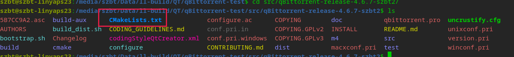

# 在玲珑容器中编译基于Qt5的开源应用--qBittorrent

在学习上一章节 `玲珑应用构建工程基础知识` 后, 我们即将步入实操课堂, 利用所学知识去正式构建一款玲珑应用.
今天, 我们将演示进入玲珑容器并将一款开源图形应用 `qBittorrent` 的源代码编译为二进制文件并测试运行

## 前期准备

根据 `玲珑应用构建工程基础知识` 中对于 `玲珑应用构建工程通用资源的规范` 要求, 我们应当为一款图形化应用同时提供保障桌面用户体验的 `icons` 图标文件及 `desktop` 启动文件

但本节实操课堂仅在玲珑容器中进行编译、测试操作, 因此暂时不需要准备通用资源

本次分享基于 `deepin 23` 发行版, 因此在进行以下任意步骤前均需要准备一个可以构建玲珑应用的 `deepin 23` 系统环境:

1. 确保环境中已经安装 `ll-builder` 构建套件, 不同发行版安装方式参考: [安装玲珑](https://linyaps.org.cn/guide/start/install.html)

2. 由于在构建过程中我们需要联网获取玲珑容器的运行库以及可能需要的第三方库, 因此我们需要保障全操作过程能够得到顺畅的网络连接

3. 在通过玲珑容器编译前, 你最好先在比较接近本次构建容器的 `deepin 23` 中成功编译过 `qBittorrent` 以确保你对源代码编译有一定的了解

4. 结合上一节 [玲珑应用构建工程 `linglong.yaml` 规范] 并按照以下模板简单编写一版玲珑构建工程配置文件 `linglong.yaml`, 以此来生成一个符合要求的容器

主要有以下需要关注的点: \* 由于本次操作是直接进入容器进行操作, 因此 `build` 部分的构建规则可不详细写 \* 由于本次涉及编译操作, 为了能够极大程度包含所需的运行库, 我们加入 `runtime` 段, 具体编写规范参考 [玲珑应用构建工程基础知识]

```yaml
# SPDX-FileCopyrightText: 2023 UnionTech Software Technology Co., Ltd.
#
# SPDX-License-Identifier: LGPL-3.0-or-later

version: "4.6.7.2"

package:
  id: org.qbittorrent.qBittorrent
  name: "qBittorrent"
  version: 4.6.7.2
  kind: app
  description: |
    qBittorrent binary

base: org.deepin.foundation/23.0.0
runtime: org.deepin.Runtime/23.0.1

command:
  - /opt/apps/org.qbittorrent.qBittorrent/files/bin/qbittorrent

source:
  - kind: local
    name: "qBittorrent"

build: |
  mkdir -p ${PREFIX}/bin/ ${PREFIX}/share/
```

### 项目编译演示

\*这里需要回顾一个知识点: 根据 [玲珑应用目录结构规范], 与构建工程配置文件 `linglong.yaml` 同级的构建目录将被映射为 `/project` 目录
万事俱备, 我们就可以开始编译了

1. 为了方便操作, 我们在构建目录下同时开启两个shell窗口, 分别用于 `玲珑容器操作` 和 `普通操作`

2. 在完成准备 `linglong.yaml`编辑后, 我们就可以开始生成容器了, 执行有限的操作以直接进入玲珑容器:

```
szbt@szbt-linyaps23:/media/szbt/Data/ll-build/QT/qBittorrent-git$ ll-builder build --exec bash
```

路径发生类似以下变化时, 即意味着我们已经进入玲珑容器中了

```
szbt@szbt-linyaps23:/project$
```

3. 通过 `普通操作` 窗口解压 `qBittorrent-4.6.7` 源码到构建目录中, 我这里单独解压到一个子目录中

```
szbt@szbt-linyaps23:/media/szbt/Data/ll-build/QT/qBittorrent-git$ tar -xvf qBittorrent-4.6.7-git-origin-src.tar.zst -C src/
```

4. 源码解压后, 根据 [玲珑应用构建基本步骤], 我们在编译任意源代码前应该正确选择使用何种编译系统/工具. 我们通过观察 `qBittorrent-4.6.7` 源码目录, 可以看到其存在 `CMakeLists.txt` 文件, 这是 `CMake` 构建项目.
   

5. 由于 [qBittorrent INSTALL](https://github.com/qbittorrent/qBittorrent/blob/release-4.6.7/INSTALL) 中简要描述了本项目主要使用的运行库, 因此我们可以对照此文档来判断哪些运行库存在与玲珑提供的 `base`、 `runtime` 中或哪些运行库并未被提供的. 对于暂未被正式提供的运行库, 在编译主程序前我们可能需要先预编译必要的第三方库.

由于文档所述需要的运行库较少, 此次我们可以先直接进行一次测试编译来确认运行库缺失情况

6. 事不宜迟, 我们通过 `玲珑容器操作` 窗口进入源码目录, 为了尽量避免对源目录的干扰, 我这里新建一个 `build` 目录用于编译. 进入 `build` 目录后我们输入CMake相关配置参数来配置构建工程.
   根据[玲珑应用目录结构规范], 我们将 `DCMAKE_INSTALL_PREFIX` 赋予 `$PREFIX` 的值, 最终我在本地执行了以下操作:

```
	cmake -DCMAKE_BUILD_TYPE=Release\
 -DCMAKE_INSTALL_PREFIX=$PREFIX ..
```

7. 可以从图中看到, 这里出现了一个错误导致无法完成配置. 我们看到 `pkg-config` 出现错误: `libtorrent-rasterbar>=1.2.19` 库不能满足条件:


```
-- Found PkgConfig: /bin/pkg-config (found version "1.8.1")
-- Checking for module 'libtorrent-rasterbar>=1.2.19'
```

我单独通过 `pkg-config` 亦无法获取该库的相关信息:

```
szbt@szbt-linyaps23:/project/src/qBittorrent-release-4.6.7-szbt2/build$ pkg-config --print-provides libtorrent-rasterbar
```

结合此报错, 基本可以判断为该库缺失, 因此我们需要在编译主程序前编译并安装此第三方库

8. 我们返回`普通操作` 窗口将: `libtorrent-rasterbar>=1.2.19` 库对应的源码下载到当前构建目录中, 进入`玲珑容器操作` 窗口重新编译

9. 源码解压后, 根据 [玲珑应用构建基本步骤], 我们在编译任意源代码前应该正确选择使用何种编译系统/工具. 我们通过观察 `libtorrent-rasterbar-2.0.9` 源码目录, 可以看到其存在 `CMakeLists.txt` 文件, 这是 `CMake` 构建项目.


10. 我们通过 `玲珑容器操作` 窗口进入源码目录, 为了尽量避免对源目录的干扰, 我这里新建一个 `build` 目录用于编译. 进入 `build` 目录后我们输入CMake相关配置参数来配置构建工程.
    根据[玲珑应用目录结构规范], 我们将 `DCMAKE_INSTALL_PREFIX` 赋予 `$PREFIX` 的值, 最终我在本地执行了以下操作:

```
	cmake -DCMAKE_BUILD_TYPE=Release\
 -DCMAKE_INSTALL_PREFIX=$PREFIX ..
	make -j$(nproc)
	make install
```

可以看到, 第三方库 `libtorrent-rasterbar-2.0.9` 成功完成编译并安装到容器的 `$PREFIX` 目录中了, 我们可以开启下一个操作

11. 我们返回 `玲珑容器操作` 窗口进入 `qBittorrent-4.6.7` 源码目录,重新执行配置、编译、安装操作, 均不存在报错了.

### 编译结果测试

在流程结束后, 我们在 `$PREFIX` 目录中找到该项目的二进制执行文件 `/opt/apps/org.qbittorrent.qBittorrent/files/bin/qbittorrent` 并在容器中运行测试 \* 该操作需要在图形化桌面的终端操作, 否则有可能无法调起程序的图形界面

看起来因为并不是直接通过容器启动, 发生了运行库无法找到的问题, 因为报错的库也在$PREFIX中, 因此我们直接通过变量 `LD_LIBRARY_PATH` 来指定动态运行库寻找路径


至此, 足以证明 `基于Qt5的开源应用--qBittorrent` 可以在 `如意玲珑` 应用容器中成功编译并运行!
