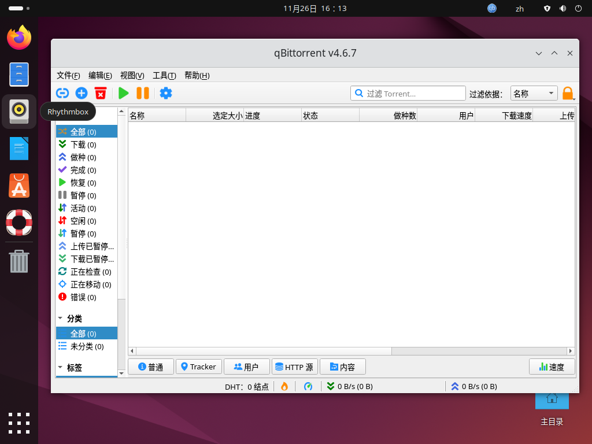

# 将基于Qt5的开源应用--qBittorrent 适配为支持自动化的玲珑应用构建工程

在学习上一章节 `在玲珑容器中编译基于Qt5的开源应用--qBittorrent` 后, 我们已经大概了解了在玲珑容器中通过怎么样的操作可以将基于Qt5的开源应用--qBittorrent项目源代码编译为可以运行的二进制程序文件.

今天, 我们在此基础上补齐 `玲珑应用构建基本步骤` 中的最后步骤--编写一份完整的玲珑应用构建工程配置文件 `linglong.yaml`, 主要实现以下的目标:

1. 自动化拉取开源项目源代码
2. 自动应用对于源代码进行修改的patch
3. 自动执行编译构建、安装操作

## 前期准备

根据 `玲珑应用构建工程基础知识` 中对于 `玲珑应用构建工程通用资源的规范` 要求, 我们应当为一款图形化应用同时提供保障桌面用户体验的 `icons` 图标文件及 `desktop` 启动文件

因此, 我们今天为了能够编写自动编译 `qBittorrent` 的完整 `linglong.yaml`,需要额外准备以下材料:

1. 非二进制文件通用资源, icons图标、desktop文件
2. 主程序 qBittorrent 开源项目的仓库git信息、tag版本、commit信息
3. 第三方运行库 libtorrent 开源项目的仓库git信息、tag版本、commit信息

### 通用资源准备

由于在上节课堂中我们在玲珑容器内已经成功编译并运行了 `qBittorrent`, 并且这款应用在安装到$PREFIX之后一并提供了icons目录、desktop启动文件
我们对这两项进行检查, 确认均符合 `Freedesktop XDG规范`, 因此我们仅需要直接从容器中复制到本地即可, 即复制到构建目录 `/project` 中.

```
ziggy@linyaps23:/project/src/qBittorrent-release-4.6.7-szbt2/build$ ls $PREFIX/share/applications/
org.qbittorrent.qBittorrent.desktop
```

```
ziggy@linyaps23:/project/src/qBittorrent-release-4.6.7-szbt2/build$ ls $PREFIX/share/icons/hicolor/128x128/apps/
qbittorrent.png
```

于是, 我们得到了 `非二进制文件通用资源`, 为了方便被构建组件使用, 我这里将这些文件放到了构建目录的 `template_app` 子目录中, 现在呈现此类结构:

```
template_app
├── linglong.yaml
└── template_app
    ├── applications
    │   └── org.qbittorrent.qBittorrent.desktop
    ├── icons
    │   └── hicolor
    │       ├── 128x128
    │       │   ├── apps
    │       │   │   └── qbittorrent.png
    │       │   └── status
    │       │       └── qbittorrent-tray.png
    │       └── scalable
    │           ├── apps
    │           │   └── qbittorrent.svg
    │           └── status
    │               ├── qbittorrent-tray-dark.svg
    │               ├── qbittorrent-tray-light.svg
    │               └── qbittorrent-tray.svg
```

### desktop 启动文件定制

根据基础知识课程的 `玲珑应用构建工程通用资源的规范`, 我们需要确保当前的desktop文件符合相关规范
我们打开从容器中导出的desktop文件, 检查Exec和Icon字段, 得出以下结果:

```
[Desktop Entry]
Categories=Network;FileTransfer;P2P;Qt;
Exec=qbittorrent %U
GenericName=BitTorrent client
Comment=Download and share files over BitTorrent
Icon=qbittorrent
```

主要有结论:

1. Icon字段值与图标文件一致, 符合规范
2. Exec字段值不为玲珑容器内编译的结果, 需要修改为符合 `玲珑应用构建工程通用资源的规范` 的内容, 这里替换为绝对路径指向容器中的具体二进制文件, 用于唤醒容器并启动该应用

## 构建工程配置文件 `linglong.yaml` 准备

在准备图形化应用所必备的通用资源后, 我们着手编写构建规则
由于在上节课程中我们已经准备了一版简单但不具备完整构建功能的 `linglong.yaml`, 因此我们可以在其基础上进行定制, 现在是初始状态:

```yaml
version: "4.6.7.2"

package:
  id: org.qbittorrent.qBittorrent
  name: "qBittorrent"
  version: 4.6.7.2
  kind: app
  description: |
    qBittorrent binary

base: org.deepin.foundation/23.0.0
runtime: org.deepin.Runtime/23.0.1

command:
  - /opt/apps/org.qbittorrent.qBittorrent/files/bin/qbittorrent

sources:
  - kind: local
    name: "qBittorrent"

build: |
  mkdir -p ${PREFIX}/bin/ ${PREFIX}/share/
```

### 构建规则编写 & 测试

为了能够平滑过渡, 我这里先将编译指令导入构建规则, 暂不引入自动拉取git仓库的内容, 以确保我们编写的构建规则准确可用
由于不建议在构建规则中执行过多 `tar` 指令, 因此我这里在构建目录下同时开启两个shell窗口, 分别用于 `玲珑容器操作` 和 `普通操作`
以下是正式开始改造的过程:

1. 通过 `普通操作` 窗口使用 `git` 将 `qBittorrent` 和 `libtorrent-rasterbar` 源码拉取或解压到构建目录中, 我这里通过源码压缩包单独解压到子目录中

```
ziggy@linyaps23:/media/szbt/Data/ll-build/QT/qBittorrent-local$ tar -xvf qBittorrent-4.6.7-git-origin-src.tar.zst -C src/
ziggy@linyaps23:/media/szbt/Data/ll-build/QT/qBittorrent-local$ tar -xvf libtorrent-rasterbar-2.0.9.tar.gz -C 3rd/

```

2. 从 `玲珑应用目录结构规范` 得知, 构建目录会被映射为 `/project`, 因此我们需要将上节课程中使用的手动编译命令写入 `build` 模块中

```
build: |
  mkdir -p ${PREFIX}/bin/ ${PREFIX}/share/
  ##Build 3rd libs 注释:进入 `libtorrent-rasterbar` 源码目录并编译安装到容器内
  mkdir /project/3rd/libtorrent-rasterbar-2.0.9/build
  cd /project/3rd/libtorrent-rasterbar-2.0.9/build
  cmake -DCMAKE_BUILD_TYPE=Release \
        -DCMAKE_INSTALL_PREFIX=$PREFIX ..
  make -j$(nproc)
  make install
  ##Build main 注释:进入 `qBittorrent` 源码目录并编译安装到容器内
  mkdir /project/src/qBittorrent-release-4.6.7-szbt2/build
  cd /project/src/qBittorrent-release-4.6.7-szbt2/build
  cmake -DCMAKE_BUILD_TYPE=Release \
        -DCMAKE_INSTALL_PREFIX=$PREFIX ..
  make -j$(nproc)
  make install
  ##Extract common res 注释: 将通用文件复制安装到容器对应目录内, 符合 `玲珑应用目录结构规范`
  cp -rf /project/template_app/* ${PREFIX}/share/
```

在将此块构建规则补全后, 我们可以开始尝试通过自动化构建来将本地源码编译为二进制程序并导出玲珑应用安装包 `binary.layer` 了 \* 由于此版配置文件不提供解压、删除功能, 因此每次重新构建前均需要将这些目录清空并重新解压

### 本地一站构建测试

在补全 `build` 模块后, 此时的 `linglong.yaml` 状态:

```yaml
version: "2"

package:
  id: org.qbittorrent.qBittorrent
  name: "qBittorrent"
  version: 4.6.7.2
  kind: app
  description: |
    qBittorrent binary

base: org.deepin.foundation/23.0.0
runtime: org.deepin.Runtime/23.0.1

command:
  - /opt/apps/org.qbittorrent.qBittorrent/files/bin/qbittorrent

source:
  - kind: local
    name: "qBittorrent"

build: |
  ##Build 3rd libs
  mkdir -p ${PREFIX}/bin/ ${PREFIX}/share/
  mkdir /project/3rd/libtorrent-rasterbar-2.0.9/build
  cd /project/3rd/libtorrent-rasterbar-2.0.9/build
  cmake -DCMAKE_BUILD_TYPE=Release \
        -DCMAKE_INSTALL_PREFIX=$PREFIX ..
  make -j$(nproc)
  make install
  ##Build main
  mkdir /project/src/qBittorrent-release-4.6.7-szbt2/build
  cd /project/src/qBittorrent-release-4.6.7-szbt2/build
  cmake -DCMAKE_BUILD_TYPE=Release \
        -DCMAKE_INSTALL_PREFIX=$PREFIX ..
  make -j$(nproc)
  make install
  ##Extract common res
  cp -rf /project/template_app/* ${PREFIX}/share/
```

此刻我们可以返回构建目录, 开始构建测试了, 执行:

```
ziggy@linyaps23:/media/szbt/Data/ll-build/QT/qBittorrent-local$ ll-builder build -v
```

得益于在玲珑容器中的编译笔记, 此次构建很快就成功结束了, 我们执行以下指令来将容器导出为玲珑应用安装包 `binary.layer` :

```
ziggy@linyaps23:/media/szbt/Data/ll-build/QT/qBittorrent-local$ ll-builder export --layer
```

## 本地构建结果测试

在得到玲珑应用安装包后, 我在不同支持玲珑环境的主流发行版上尝试体验, 来确认通过玲珑容器构建的二进制程序是否存在通用性

### deepin 23


### openKylin 2.0


### Ubuntu 2404



### OpenEuler 2403


至此, 足以证明 `基于Qt5的开源应用--qBittorrent` 可以构建完成后, 在支持 `如意玲珑` 应用方案的第三方发行版中成功运行!
