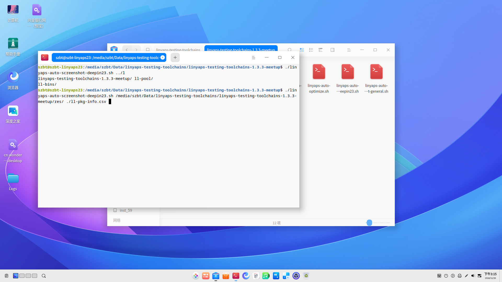
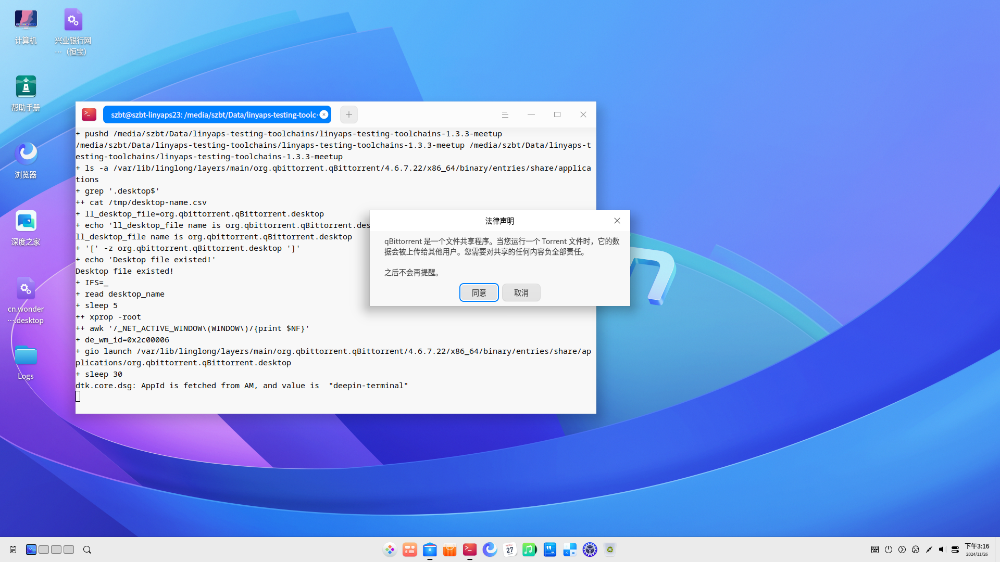
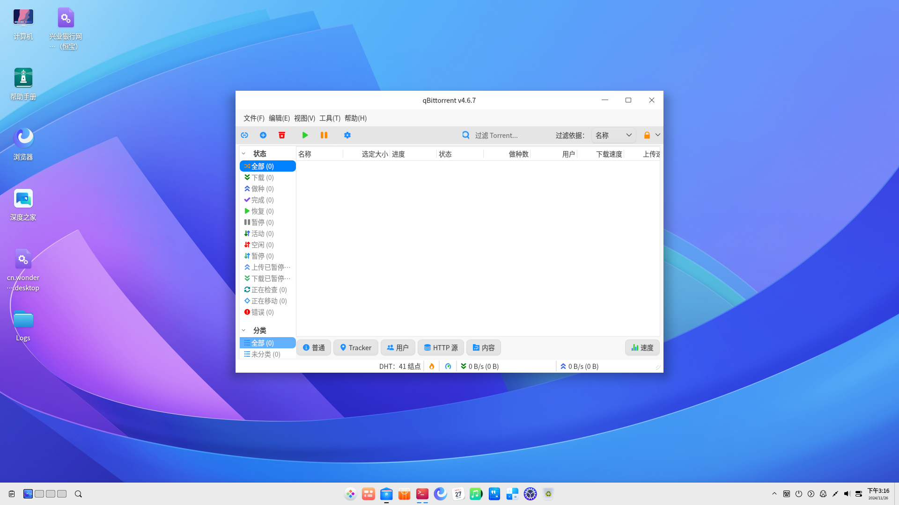
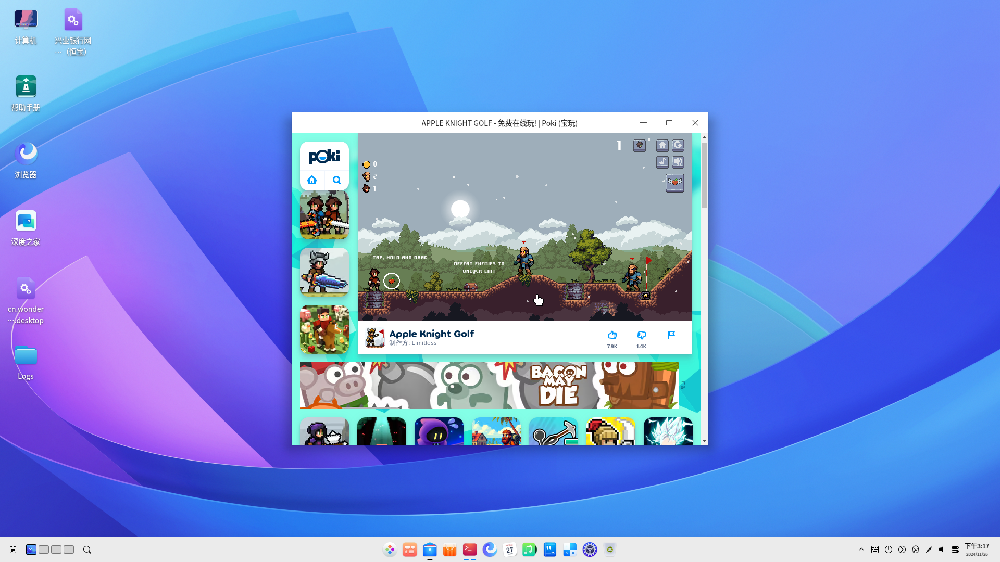
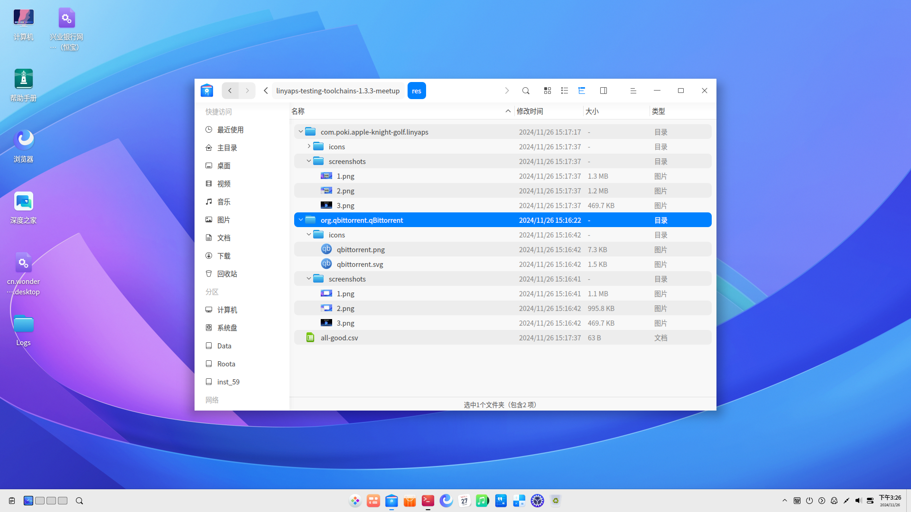

# 玲珑应用兼容性测试进阶--玲珑应用自动化测试套件
大家可以发现, 在我们前面的玲珑应用编译之后, 都是通过手动安装软件包、启动应用来检验兼容性的
但是这里会衍生出一个问题: 随着需要测试的应用不断增加, 人工测试的方式是否显得相对低效率?
为此, 我向各位介绍如意玲珑社区中目前开放给各生态贡献者使用、学习的 `玲珑应用自动化测试套件 -- Next Linyaps Testing Toolchains`

## 项目介绍
`Next Linyaps Testing Toolchains` 是一套shell脚本组成的玲珑应用测试工具链，旨在为玲珑应用测试带来更多便捷的方案
本项目是[linglong-automan](https://gitee.com/ziggy615/linglong-automan)的正统精神传承，并承诺永久开源

## 已实现功能

1. 将指定目录下零散的 `*binary.layer` 文件整理为一个具备规范化的目录结构: `xxx/id/package` 并生成存放玲珑应用id、应用版本号的两个表格

2. 指定整理完成的玲珑文件存放目录后，开启流水化安装进程

3. 指定资源存放目录和应用信息表格后，根据 `安装情况`、 `desktop文件存在状态` 、`窗口生成状态` 来模拟通过desktop文件启动应用，并对测试结果进行截图
\* 当前代码部分功能依赖 `deepin 23` 系统组件，在其他发行版使用时需要重新适配

4. 对已安装的玲珑应用进行图标文件扫描, 判断当前应用icons目录及文件是否符合 `Freedesktop XDG` 规范并收集图标

5. 对已安装的玲珑应用进行批量卸载

## 代码结构解析
进入套件仓库, 可以看到该套件根据功能/作用划分为了数个关键独立脚本, 大体为:

1. `linyaps-auto-optimize.sh`, 玲珑应用安装包 `binary.layer` 整理工具. 将某目录下所有 `binary.layer` 文件整理为符合测试套件的结构并产出两个表格用于记录玲珑应用id、版本号如:
```
org.qbittorrent.qBittorrent/package/org.qbittorrent.qBittorrent_4.6.7.22_x86_64_binary.layer
com.poki.apple-knight-golf.linyaps/package/com.poki.apple-knight-golf.linyaps_28.3.3.2_x86_64_binary.layer
```

ll-pkg-name.csv
```
org.qbittorrent.qBittorrent
com.poki.apple-knight-golf.linyaps
```

ll-pkg-version.csv
```
4.6.7.22
28.3.3.2
```

2. `linyaps-auto-install-release.sh`, 玲珑应用安装包 `binary.layer` 批量安装工具, 用于安装经过 `linyaps-auto-optimize.sh` 整理的安装包

3. `linyaps-auto-screenshot-deepin23.sh`, 应用自动测试套件, 包含运行状态截图功能, 仅限 `deepin 23` 环境使用

4. `linyaps-auto-screenshot-general.sh`, 应用自动测试套件通用版本, 不包含运行状态截图功能, 提供给非 deepin 23 环境使用

5. `linyaps-auto-uninstall-release.sh`, 玲珑应用批量卸载工具

## Next Linyaps Testing Toolchains运用实操
在介绍完总体功能、代码逻辑后, 我们基于 `deepin 23` 演示如何通过 `玲珑应用自动化测试套件` 完成对前面课时产出的玲珑应用安装包 `binary.layer` 进行批量测试

### 环境预备
在开始使用测试套件前,你需要确保当前环境满足以下条件
1. 本次实操中所使用的自助兼容性测试套件部分功能需要使用 `Linux x11` 窗口管理工具,因此在使用前需要安装以下软件包:
```
wmctrl x11-utils
```
2. 测试套件通过x11窗口管理工具来判断应用窗口启动状态,因此需要确保你的系统是 `x11` 环境而不是 `Wayland` 环境

3. `wmctrl` 与 `xwininfo` 组件可以正常生效,可以通过`xwininfo`查询窗口信息

4. 由于 `deepin 23` 下提供了兼容性测试结果截图功能, 因此需要安装相关的软件包:
```
deepin-screen-recorder imagemagick-6.q16
```

5. 手动启动一次 `deepin-screen-recorder`, 确系统截图保存路径为当前用户的~/Pictures/Screenshots中,且该目录为空

### 启动测试功能

1. 在上节实操课时中, 我们得到了 `qBittorrent--4.6.7` 的玲珑安装包 `org.qbittorrent.qBittorrent_4.6.7.22_x86_64_binary.layer`, 为了方便演示套件的批量支持能力, 我这里单独另找一个安装包

2. 现在我们有两款玲珑应用的安装包, 首先执行 `linyaps-auto-optimize.sh` 脚本来整理目录
此脚本主要使用两个参数, 用于指向当前存放玲珑应用安装包 `binary.layer` 的目录 `$ll_origin_pool` 及 需要整理的终点目录 `$ll_stored_pool`

3. 我在本地目录创建了两个独立目录 `ll-bins` `ll-pool` 用于指向 `$ll_origin_pool` 及 `$ll_stored_pool`
 `ll-bins` 现在的目录结构:
```
├── ll-bins
│   ├── org.qbittorrent.qBittorrent_4.6.7.22_x86_64_binary.layer
│   └── com.poki.apple-knight-golf.linyaps_28.3.3.2_x86_64_binary.layer
```

4. 执行目录整理操作
```bash
ziggy@linyaps23:/media/szbt/Data/linyaps-testing-toolchains$ ./linyaps-auto-optimize.sh ./ll-bins ./ll-pool
```

整理完成后, 目录呈现该结构:

```
ll-pool/
├── org.qbittorrent.qBittorrent
│   └── package
│       └── org.qbittorrent.qBittorrent_4.6.7.22_x86_64_binary.layer
└── com.poki.apple-knight-golf.linyaps
    └── package
        └── com.poki.apple-knight-golf.linyaps_28.3.3.2_x86_64_binary.layer

```

5. 目录整理后生成了 `ll-pkg-name.csv` `ll-pkg-version.csv` 两个用于记录应用信息的表格, 我们将两列内容合并为一个新表格 `ll-pkg-info.csv` :

ll-pkg-info.csv
```
org.qbittorrent.qBittorrent,4.6.7.22
com.poki.apple-knight-golf.linyaps,28.3.3.2
```

6. 根据此文件, 我们可以开始批量安装玲珑应用了
此脚本主要使用一个参数, 用于指向当前整理完成的终点目录 `$ll_stored_pool`:
```bash
ziggy@linyaps23:/media/szbt/Data/linyaps-testing-toolchains$ linyaps-auto-install-release.sh ./ll-pool
```

7. 安装完玲珑应用后以及完成所有前置工作后, 我们可以开展测试流程了. 这里我们新建一个 `res` 目录, 用于存放图标、截图等测试结果资源

8. 在图形化界面打开终端, 执行截图脚本, 由于我们是 `deepin 23 x11` 环境并安装了必要的程序, 因此运行 `linyaps-auto-screenshot-deepin23.sh`
此脚本主要使用两个参数, 用于指向用于放置测试结果资源的目录 `$ll_res_pool` 以及 记录应用信息的表格 `$ll_pkgname_list`, 这里指的是我们上一环节得到的新表格 `ll-pkg-info.csv` :

```bash
ziggy@linyaps23:/media/szbt/Data/linyaps-testing-toolchains$ ./linyaps-auto-screenshot-deepin23.sh ./res ./ll-pkg-info.csv
```
\* 谨记, 此脚本必须在图形化终端下执行, 否则无法正常拉起进程

9. 在脚本启动后, 将该终端设置为最小化窗口保留在背景运行, 测试套件将会判断应用安装情况、desktop文件存在情况来 `启动` 和 `关闭` 应用窗口




10. 在满足运行要求后, 套件将会模拟通过desktop文件启动程序并在约 30s 延时后对窗口进行判断, 检查应用运行后是否生成新窗口




11. 应用成功运行后, 将会依次完成截图、图标检测&获取操作

12. 在测试完成后, 可以在`res` 目录看到不同状态的表格及测试结果的材料, 由于这里的两款应用均通过了兼容性测试, 因此会在 `all-good.csv` 中记录
否则会出现两种异常情况:
a. 超时未生成窗口的应用则会被写入`failed.csv`文件中,以判断为应用无法启动
b. 玲珑应用目录内不包含图标文件,则会被写入`icons-missing.csv`文件中,不满足如意玲珑社区中对于图形化应用的规范

```
res/
├── all-good.csv
├── com.poki.apple-knight-golf.linyaps
│   ├── icons
│   │   └── com.poki.apple-knight-golf.png		##应用图标文件
│   └── screenshots	##应用兼容性测试截图
│       ├── 1.png
│       ├── 2.png
│       └── 3.png
└── org.qbittorrent.qBittorrent
    ├── icons
    │   ├── qbittorrent.png
    │   └── qbittorrent.svg
    └── screenshots
        ├── 1.png
        ├── 2.png
        └── 3.png
```



至此, 我们成功通过玲珑应用自动化测试套件, 完成了针对历史课时中产出的玲珑应用的兼容性测试