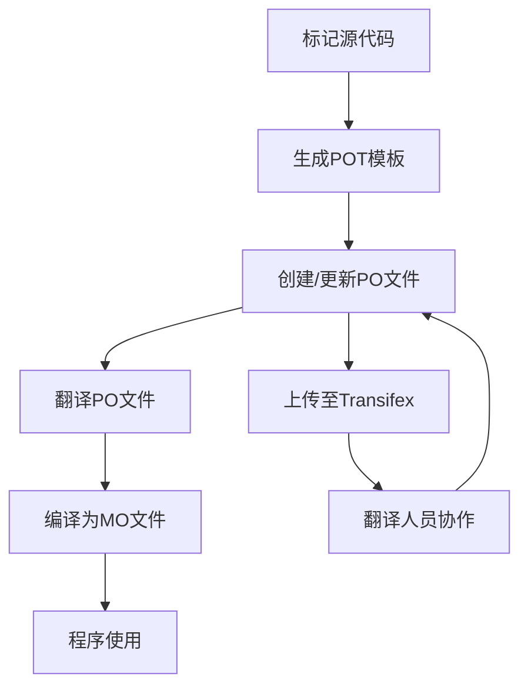

# 构建指南

## 构建依赖安装

在构建linglong之前，确保已经安装以下依赖：

- cmake,
- debhelper-compat (= 12),
- intltool,
- libcli11-dev (>= 2.4.1) | hello,
- libcurl4-openssl-dev,
- libdeflate-dev,
- libelf-dev,
- libexpected-dev (>= 1.0.0~dfsg-2~bpo10+1) | hello,
- libfuse3-dev,
- libglib2.0-dev,
- libgmock-dev,
- libgtest-dev,
- liblz4-dev,
- liblzma-dev,
- libostree-dev,
- libpcre2-dev,
- libselinux1-dev,
- libssl-dev,
- libsystemd-dev,
- libyaml-cpp-dev (>= 0.6.2),
- libzstd-dev,
- nlohmann-json3-dev (>= 3.5.0),
- pkg-config,
- qt6-base-dev | qtbase5-dev,
- qt6-base-private-dev | qtbase5-private-dev,
- systemd,
- zlib1g-dev

玲珑使用 [cmake 预设]，你可以通过运行以下命令来构建和安装玲珑：

```bash
cmake --workflow --preset release
sudo cmake --install build-release
```

如果你想开发或调试玲珑：

```bash
export CMAKE_CXX_COMPILER_LAUNCHER="$(command -v ccache)"

# 配置，构建然后运行测试
cmake --workflow --preset debug

# 仅配置
cmake --preset debug

# 仅构建
cmake --build --preset debug

# 仅运行测试
ctest --preset debug
```

[cmake 预设]: https://cmake.org/cmake/help/latest/manual/cmake-presets.7.html

## 打包

玲珑使用 [CPM.cmake] 来下载本地找不到的依赖项。

如果你想禁用这个功能：

```bash
export CPM_USE_LOCAL_PACKAGES=1
```

更多信息，请查看 [CPM.cmake] 的 README。

[CPM.cmake]: https://github.com/cpm-cmake/CPM.cmake

## 国际化与翻译管理

如意玲珑使用GNU gettext工具链和Transifex平台进行国际化(i18n)管理。

### 翻译工作流程



### 1. 环境配置

#### 1.1 安装Transifex CLI工具

```bash
# 下载最新版tx工具
wget https://github.com/transifex/cli/releases/download/v1.6.17/tx-linux-amd64.tar.gz
tar -xzf tx-linux-amd64.tar.gz -C $HOME/.local/bin/
tx -v  # 验证版本
```

#### 1.2 配置Transifex

1. 创建~/.transifexrc文件：

    ```plaintext
    [https://www.transifex.com]
    rest_hostname = https://rest.api.transifex.com
    api_hostname = https://api.transifex.com
    hostname = https://www.transifex.com
    token = xxxxxxxxxxxxxxxxx
    ```

2. 配置项目.tx/config文件：

```plaintext
[main]
host = https://www.transifex.com

[o:linuxdeepin:p:linyaps:r:6e861fdc8edf8f03ac6f0b629a022f2f]
file_filter = po/<lang>.po
source_file = po/en_US.po
source_lang = en_US
type = PO
```

### 2. 翻译文件生成与管理

#### 2.1 生成翻译模板(POT)

```bash
# 在构建目录执行
make pot  # 生成po/linyaps.pot模板文件
```

#### 2.2 更新翻译文件(PO)

```bash
make po              # 更新所有语言PO文件
make linyaps_zh_CN.po  # 更新指定语言PO文件
```

#### 2.3 将文件推送到仓库供Transifex使用

```bash
git add po/linyaps.pot po/en_US.po
git push $(REMOTE) $(BRANCH)
```

#### 2.4 翻译协作流程

1. 上传新翻译文件到Transifex：

    ```bash
    tx push -a # 推送所有语言
    tx push --translation -f --languages zh_CN # 推送指定语言
    ```

**TIPS：** 一般我们只推送当前系统语言的翻译文件，翻译人员会在Transifex上协作完成其他语言的翻译。

2. 下载翻译成果：

    ```bash
    tx pull -a  # 下载所有语言
    tx pull -l zh_CN  # 下载指定语言
    ```

### 3. 编译与测试

1. 编译PO为二进制MO文件：

    ```bash
    msgfmt po/zh_CN.po -o share/locale/zh_CN/LC_MESSAGES/linyaps.mo
    ```

2. 测试翻译效果：

    ```bash
    LANG=zh_CN.UTF-8 ll-cli --help
    ```

### 最佳实践

1. 代码中标记字符串：

    ```cpp
    // 使用gettext宏
    #include <libintl.h>
    #define _(str) gettext(str)

    printf(_("Hello World"));
    ```

2. 为翻译添加上下文：

    ```cpp
    /// TRANSLATORS: 这里指系统用户名，不超过20个字符
    printf(_("User"));

    // 复数形式处理
    printf(ngettext("%d file", "%d files", count), count);
    ```

3. 翻译质量检查：

    ```bash
    # 检查未翻译字符串
    msgfmt --statistics po/zh_CN.po

    # 检查格式错误
    msgfmt -cv po/zh_CN.po
    ```

4. 翻译协作规范：
   - 每个翻译条目必须保留原文上下文
   - 避免在翻译中使用变量占位符（如%s）
   - 保持术语一致性（建立术语表）
   - 中文翻译使用全角标点符号

5. 定期同步翻译：
   - 每周更新POT模板并上传至Transifex
   - 每月从Transifex拉取所有语言更新
   - 发布前进行全语言测试：

     ```bash
     for lang in $(cat po/LINGUAS); do
       LANG=$lang.UTF-8 ll-cli --help > /dev/null || echo "$lang test failed"
     done
     ```

6. 常见问题处理：
   - 字符串更新但翻译未同步：使用`msgmerge`合并
   - 翻译格式错误：检查引号和特殊字符
   - 变量顺序问题：使用位置参数（如%1$s）
   - 长度限制：中文通常比英文简短
